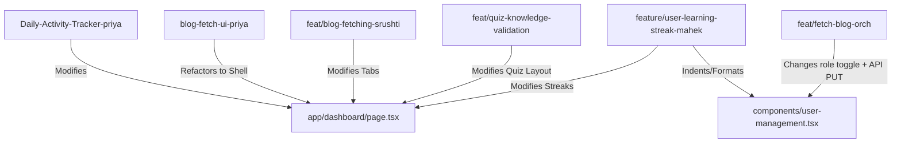

You are acting as a Senior Git Integration Engineer for the
creole-knowledge-portal repository.

Your task is to integrate ONLY the branches and functionality explicitly
listed in the "Git Repository Branch Audit & Merge Integration Strategy Plan"
provided for this repository.

The audit document specifies:
Add the new branch name:
    feature/unified-portal-integration

# Git Repository Branch Audit & Merge Integration Strategy Plan

This document provides a comprehensive audit of all **18 branches** (both local and remote) found in the `creole-knowledge-portal` repository. It outlines which data/features live on which branch, categorizes redundant/obsolete code, details expected merge conflicts, and provides a step-by-step developer resolution guide to merge these features into a unified base.

---

## 1. Branch Feature Mapping (Which Data is Where)

To understand where development is active, we have cataloged the branches into distinct functional domains.

### A. Core User Dashboard & Frontend Layout
*   **`blog-fetch-ui-priya` (Current Branch)**
    *   **Last Commit:** `c6769cd2` - "feat: add user dashboard blog-fetch UI (3-tab learning hub)" by *PriyaDhanani12* (2026-06-30)
    *   **Scope & Data:** Rewrote `app/dashboard/page.tsx` into a modular `<DashboardShell />` layout (`components/dashboard/DashboardShell.tsx`). Integrates three key sub-tabs: Daily Blog, Past Blogs, and Activity Tracker. Contains dashboard visual widgets (TopicMix, ReadingHeatmap, ReadingTimer, ReadingTrendChart) and client-side helpers (`lib/data/streak.ts`, `lib/data/activity.ts`).
*   **`feat/blog-fetching-srushti`**
    *   **Last Commit:** `f8d1a062` - "activity tracker and past blogs" by *srushtiamin-creole* (2026-08-10) — **Most Recent Commit**
    *   **Scope & Data:** Modifies `app/dashboard/page.tsx` directly to render specific daily/past/activity tab panels. Introduces calendar widget with sticky sidebars in `components/dashboard/ActivityTab.tsx`, `DailyBlogTab.tsx`, and `PastBlogsTab.tsx`. Integrates Next.js middleware routing and admin dashboard role navigation.

### B. Ingestion, Crawling & AI Scoring Engine
*   **`feat/fetch-blog-orch`**
    *   **Last Commit:** `b51f0193` - "chore: update environment configuration for local development..." by *cr-arunkumar* (2026-07-11)
    *   **Scope & Data:** Sets up the Python backend (`fetch-blogs/`) orchestrator. Integrates a Celery task framework (`celery_app.py`), vector search backend (`vector_search.py`), robots.txt caching, scrapers (Dev.to, HackerNews, Reddit, RSS), and publishes results straight to MongoDB/Supabase database using a Celery pipeline.
*   **`feature/llm-strategy-b-implementation`**
    *   **Last Commit:** `4260d499` - "feat: implement LLM Strategy B — semantic ranking + Jina + LLM re-ranker" by *PriyaDhanani12* (2026-06-13)
    *   **Scope & Data:** Implements advanced AI ranking/filtering pipeline using the Jina Reader API crawler, sentence-transformer embeddings, and an LLM re-ranker logic for high-quality article curation.

### C. Gamification, Quizzes & User Streaks
*   **`Daily-Activity-Tracker-priya`**
    *   **Last Commit:** `5492a884` - "feat: single daily morning briefing refactoring and reload resilient cookie gamification tracking" by *PriyaDhanani12* (2026-05-24)
    *   **Scope & Data:** Adds database migrations (`supabase_migrations.sql`) defining the primary database schemas for `user_profiles` extensions (XP, levels, coins), `streaks`, `badges`, `user_badges`, and `quiz_attempts`. Implements cookie fallback tracking for local resilience and `/api/streaks/status/route.ts` to return gamification stats.
*   **`feat/quiz-knowledge-validation`**
    *   **Last Commit:** `d4a6c4f5` - "refactor: transition quiz timing to wall-clock tracking and implement automatic submission..." by *varun* (2026-06-13)
    *   **Scope & Data:** Implements Next.js AI-driven quiz generation (`lib/ai/quiz-generator.ts`), evaluation APIs (`lib/ai/quiz-evaluator.ts`), leaderboard widgets, and moderation forms (`components/submissions-moderation.tsx`).
*   **`feature/user-learning-streak-mahek`**
    *   **Last Commit:** `e01c2499` - "style: fix formatting issues across project" by *mahekkalola* (2026-05-18)
    *   **Scope & Data:** Integrates database migration `lib/supabase/migrations/20260518000000_user_streaks.sql` and Next.js Server Actions `app/actions/streak.ts` to log activity (`user_activity_logs`) and update consecutive reading streaks (`user_streaks`).

### D. Writing, SEO & Google Drive Integration
*   **`feature/blog-roulette`**
    *   **Last Commit:** `30cb04d3` - "started replace bypassed publish flow with real Google Drive upload" by *mahekkalola* (2026-07-04)
    *   **Scope & Data:** Implements "Blog Roulette" workspace where users write blogs, upload drafts, check drafts with Gemini for AI authorship/SEO keyword density suggestions (`lib/blog-roulette/seo.ts`), and publish directly into a company Google Drive folder. Includes Drive API clients and SQL migration files.

### E. Documentation & Wiki (ADRs)
*   **`feat/setup-wiki-varun`**
    *   **Last Commit:** `921ac38b` - "refactor: remove redundant loading states..." by *varun* (2026-06-13)
    *   **Scope & Data:** Adds Next.js audit logging and initial architectural index files in `wiki/`. Contains ADRs (Architecture Decision Records) 0001–0004.
*   **`feature/BlogViewer&ReadingExperience-dj`**
    *   **Last Commit:** `cfe91ea7` - "Adding the WIKI for the feature" by *cs-divyarajsinhchampavat* (2026-05-16)
    *   **Scope & Data:** Doc-only branch. Adds architectural decisions ADR-001 through ADR-005 in `wiki/decisions/` and sub-documentation in `wiki/components/`.

---

## 2. Redundant & Obsolete Branches (Do Not Use)

These branches are either already merged, obsolete, or completely superseded by newer work. They should be archived or deleted.

| Branch Name | Status | Reason for Exclusion |
| :--- | :--- | :--- |
| **`feat/blog-fetching-mit`** | **Redundant** | Completely merged into `feat/fetch-blog-orch`. The orchestration branch has all its contents and commits. |
| **`harness-data`** | **Obsolete** | Diverged only by 5 commits behind develop, 0 commits ahead. Already fully merged. |
| **`test/yash_devops`** | **Obsolete** | Fully synchronized with base `develop` (0 ahead, 0 behind). |
| **`feature/user-dashboard-learning-frontend`**| **Redundant** | 3 commits ahead of base are simply gitignore changes and workflow deletions that are already present in develop. |
| **`worktree-agent-afbf02cb8a7fb6a43`** | **Obsolete** | Older sandbox agent branch containing outdated mock ingestion logic (`lib/ingestion/scraper.ts`, `components/Daily30Feed.tsx`) which is superseded by the Celery/FastAPI crawler in `feat/fetch-blog-orch`. |
| **`feat/scraping-worker`** | **Obsolete** | Only contains minor Supabase CLI initializations that are superseded by newer migrations and lockfiles. |
| **`test/auto-pr-merge`** | **DevOps-only** | Sandbox branch testing auto-merge github actions and Slack PR button configurations. Should not be merged into product code. |

---

## 3. Core Merge Conflict Zones & Analysis

When merging the remaining functional branches (`Daily-Activity-Tracker-priya`, `blog-fetch-ui-priya`, `feature/llm-strategy-b-implementation`, `feat/blog-fetching-srushti`, `feat/fetch-blog-orch`, `feat/quiz-knowledge-validation`, and `feature/blog-roulette`) together, the following files will conflict:



### Detailed Conflict Analysis

### 1. `app/dashboard/page.tsx`
*   **Conflict Source:** `blog-fetch-ui-priya` refactored this page to a clean login checking shell that imports `<DashboardShell />`. However, `feat/blog-fetching-srushti` keeps the layout in `page.tsx` and imports individual Tab components directly. Meanwhile, `Daily-Activity-Tracker-priya` inserts local gamification simulation and cookie initialization directly into the main file.
*   **Resolution Strategy:** Preserve the shell layout architecture from `blog-fetch-ui-priya` (i.e. keep `app/dashboard/page.tsx` as a clean shell component). Inject auth state loading logic and route control into `<DashboardShell />`, but hook the tab actions (Daily, Past, Activity) directly to API endpoints `/api/digests/*`, `/api/activity`, and `/api/streaks/*` to supply live database records.

### 2. `components/user-management.tsx`
*   **Conflict Source:** `feat/fetch-blog-orch` changes the form action from direct Supabase client updates to a backend REST call (`/api/admin/users`) and adds a toggle switch to assign Admin vs User access rights. `feature/user-learning-streak-mahek` contains Prettier changes and formatting changes in the exact same lines.
*   **Resolution Strategy:** Adopt the functional API version from `feat/fetch-blog-orch` (which handles secure server-side role updates). Accept the prettier code style formatting manually from the streak branch.

### 3. `wiki/` Directory (Documentation conflicts)
*   **Conflict Source:** DJ's branch and Varun's branch both write different architectural decision records (ADRs) to `wiki/decisions/` and modify `wiki/index.md` and index logs.
*   **Resolution Strategy:** Keep all distinct ADR markdown files (none of them overlap on actual filenames since Varun uses `0001-...` and DJ uses `ADR-001-...`). Unify the links in `wiki/index.md` and `wiki/decisions/index.md` so they point to both sets of documentations.

### 4. `package.json` / Package Lockfiles
*   **Conflict Source:** Multiple feature branches add different libraries (e.g. `google-auth-library` and `@google/generative-ai` on `feature/blog-roulette`, testing tooling on `feat/quiz-knowledge-validation`).
*   **Resolution Strategy:** Union the dependencies in `package.json` manually, then discard conflicted lockfiles and run a clean `npm install` on the merged branch.

---

## 4. Integration Roadmap (Step-by-Step Merge Plan)

> [!IMPORTANT]
> The merging order is set to lay down backend schemas and ingestion components first, then merge user logic APIs, and finally overlay the frontend dashboard UI and components.

### Phase 1: Database Migration Consolidation
1.  Check out a new integration branch: `git checkout -b feature/unified-portal-integration develop`.
2.  Combine and migrate SQL files:
    *   Initialize database with `Daily-Activity-Tracker-priya`'s `supabase_migrations.sql` (implements user profile extensions, streaks, badges, attempts).
    *   Deploy quiz tables migration: `supabase/migrations/20260613000000_create_quiz_tables.sql` (from `feat/quiz-knowledge-validation`).
    *   Deploy Google Drive and Blog Roulette migrations: `supabase/migrations/*blog_roulette*.sql` (from `feature/blog-roulette`).
    > [!NOTE]
    > Discard `lib/supabase/migrations/20260518000000_user_streaks.sql` from Mahek's branch, as Priya's schema is more robust and acts as the project standard.

### Phase 2: Ingestion & Core Backend Services Integration
3.  Merge the python ingestion scraping engines:
    ```bash
    git merge origin/feat/fetch-blog-orch --no-commit
    # Resolve conflicts in components/user-management.tsx (Keep API PUT and Admin role selector)
    git commit -m "Merge branch 'feat/fetch-blog-orch' into integration"
    ```
4.  Merge LLM Strategy B ranking adjustments:
    ```bash
    git merge origin/feature/llm-strategy-b-implementation -m "Merge LLM Strategy B Ranking Pipeline"
    ```

### Phase 3: APIs and Backend Logic Integration
5.  Merge the AI Quiz evaluation logic:
    ```bash
    git merge origin/feat/quiz-knowledge-validation -m "Merge AI Quiz validation and evaluator routing"
    ```
6.  Merge the Blog Roulette publisher and Drive logic:
    ```bash
    git merge origin/feature/blog-roulette -m "Merge Google Drive publishing, SEO keyword analysis, and Blog Roulette routing"
    ```

### Phase 4: Frontend UI & Modular Dashboard Assembly
7.  Merge the user dashboard tab structure:
    ```bash
    git merge origin/blog-fetch-ui-priya --no-commit
    # Keep DashboardShell.tsx as the page framework.
    # Accept changes to vitest.config.ts.
    ```
8.  Merge Srushti's dashboard activity tracker additions:
    ```bash
    git merge origin/feat/blog-fetching-srushti --no-commit
    # Integrate Srushti's CalendarSidebar inside DashboardShell or ActivityTab.
    ```
9.  Run lockfile rebuild:
    ```bash
    rm package-lock.json node_modules -rf && npm install
    ```
10. Run tests to ensure stability:
    ```bash
    npm run test
    ```
