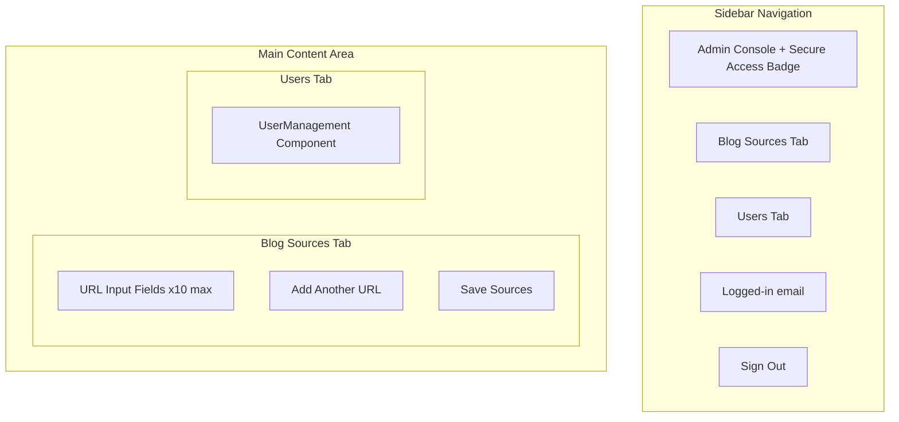
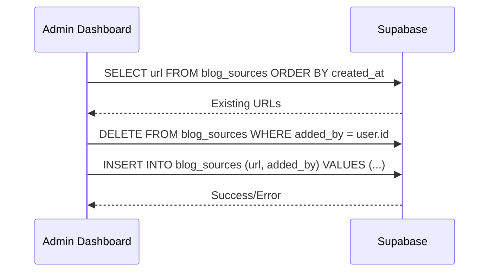

# Admin Dashboard

**File:** `app/admin/dashboard/page.tsx`
**Type:** Client Component (`'use client'`)

## Purpose

The administrative control panel for managing blog sources and user profiles. Access restricted to the admin email (`priya.dhanani@creolestudios.com`).

## UI Structure

## Tabs

### Blog Sources

- Add up to 10 blog source URLs
- Validates URL format before saving
- CRUD operations against `blog_sources` Supabase table
- Delete-and-reinsert pattern for updates (replaces all sources for the admin user)

### Users

- Embeds the [[user-management]] component
- Lists all non-admin users with profile status
- Edit user profiles (role, experience, tech stacks, interests)

## Key Behaviors

- **Admin gate:** Checks authenticated user email against hardcoded admin email; redirects non-admins to `/`
- **Tab switching:** Animated transitions between Sources and Users views
- **URL validation:** Client-side URL format validation before save
- **Responsive:** Sidebar on desktop, compact header with tab icons on mobile

## Dependencies

- `@/lib/supabase/client` — Browser Supabase client
- `@/components/user-management` — User profile management
- `motion/react` — Tab transition animations
- `lucide-react` — Icons (Plus, Trash2, Save, LogOut, Globe, ShieldCheck, etc.)

## State

| State | Type | Purpose |
|-------|------|---------|
| `activeTab` | 'sources' \| 'users' | Current active tab |
| `urls` | string[] | Blog source URL list |
| `loading` | boolean | Initial data fetch |
| `saving` | boolean | Save operation in progress |
| `error` | string \| null | Error message |
| `success` | boolean | Save success feedback |
| `user` | any | Authenticated admin user |

## Database Interaction

