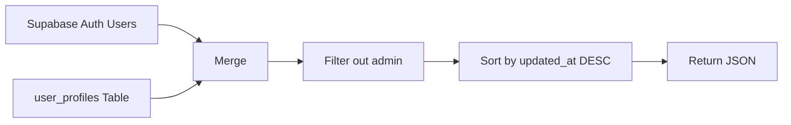

# Admin Users API

**File:** `app/api/admin/users/route.ts`
**Type:** Route Handler (Server-side)

## Purpose

Server-side API endpoint that returns all non-admin users with their merged profile data. Used by the [[user-management]] component in the admin dashboard.

## Endpoint

```
GET /api/admin/users
```

## Authorization

- Requires authenticated session (verified via server-side Supabase client)
- Must be the admin email (`priya.dhanani@creolestudios.com`)
- Returns `401 Unauthorized` for non-admin users

## Response

### Success (200)

```json
[
  {
    "user_id": "uuid",
    "email": "user@example.com",
    "current_role": "Frontend Developer",
    "years_of_experience": 3,
    "current_tech_stack": ["React", "TypeScript"],
    "primary_tech_stack": ["React", "Node.js"],
    "secondary_tech_stack": ["Python"],
    "future_interests": "AI/ML",
    "updated_at": "2025-05-16T10:00:00Z"
  }
]
```

### Error (401)

```json
{ "error": "Unauthorized" }
```

### Error (500)

```json
{ "error": "Error message" }
```

## Data Merging Logic



1. Fetches all auth users via `supabaseAdmin.auth.admin.listUsers()`
2. Fetches all profiles from `user_profiles` table
3. Merges by matching `user_id`
4. Excludes the admin user from results
5. Sorts by most recently updated

## Dependencies

- `@/lib/supabase/admin` — Service-role admin client (for `listUsers()`)
- `@/lib/supabase/server` — Server client (for auth verification)
- `next/server` — NextResponse
