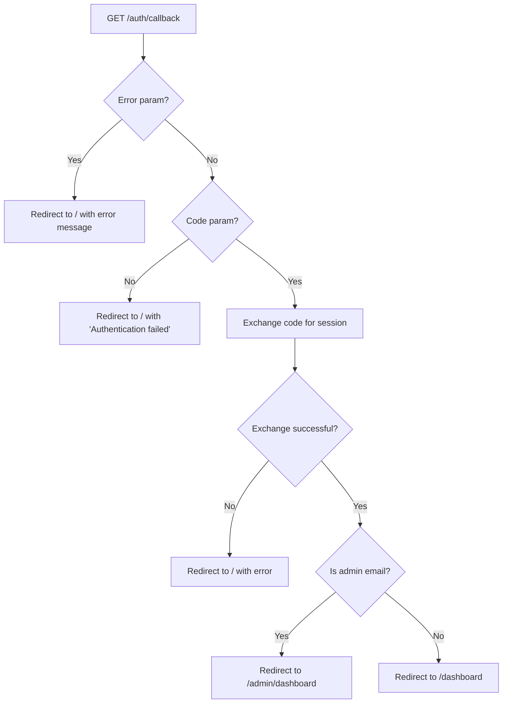

# Auth Callback

**File:** `app/auth/callback/route.ts`
**Type:** Route Handler (Server-side)

## Purpose

Handles the OAuth/OTP redirect from Supabase after a user authenticates. Exchanges the authorization code for a session and redirects the user to the appropriate dashboard.

## Flow

## URL Parameters

| Param | Description |
|-------|-------------|
| `code` | Authorization code from Supabase |
| `error` | Error type (if auth failed) |
| `error_code` | Specific error code (e.g., `otp_expired`) |
| `error_description` | Human-readable error message |
| `next` | Optional redirect path (defaults to `/dashboard`) |

## Origin Detection

The handler uses robust origin detection for redirect URLs:
- **Localhost:** Preserves full origin including port
- **Production:** Uses `https://` + hostname only (strips non-standard ports from Cloud Run URLs)

## Error Handling

- **Invalid flow state:** Provides user-friendly message about expired sessions
- **Missing user data:** Redirects with "No user found" error
- **Fatal errors:** Catches all exceptions and redirects with generic error

## Dependencies

- `@/lib/supabase/server` — Server-side Supabase client
- `next/server` — NextResponse for redirects
