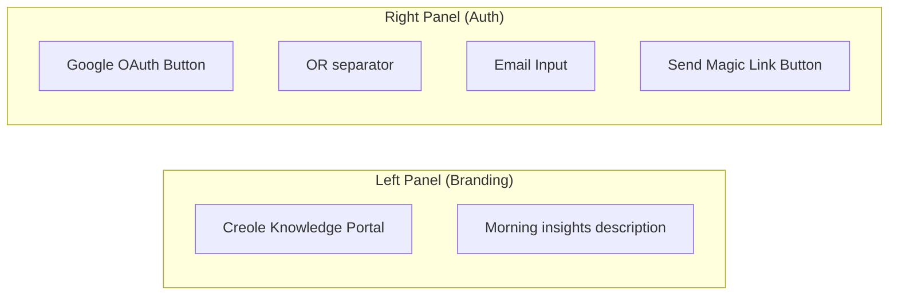

# Login Page

**File:** `app/page.tsx`
**Type:** Client Component (`'use client'`)

## Purpose

The application entry point and authentication gateway. Provides two sign-in methods for Creole Studios team members.

## Authentication Methods

1. **Google OAuth** — One-click sign-in via Google account
2. **Magic Link (OTP)** — Passwordless email-based authentication

## UI Structure

## Key Behaviors

- **Origin detection:** Automatically detects localhost vs production hostname for OAuth redirect URLs
- **Error handling:** Parses URL error params (e.g., expired OTP links) and displays user-friendly messages
- **Success state:** Shows confirmation message after magic link is sent
- **Loading state:** Disables form during submission with spinner animation
- **Hydration safety:** Renders a static placeholder until client-side mount completes

## Dependencies

- `@/lib/supabase/client` — Browser Supabase client
- `motion/react` — Entry animations
- `lucide-react` — Icons (BookOpen, Loader2, CheckCircle2, AlertCircle)

## State

| State | Type | Purpose |
|-------|------|---------|
| `email` | string | Email input value |
| `loading` | boolean | Form submission in progress |
| `error` | string \| null | Error message display |
| `success` | boolean | Magic link sent confirmation |
| `mounted` | boolean | Client-side hydration guard |

## Design Tokens

- Brand color: `#34c4f2`
- Background: Split layout (dark left, light right)
- Font: Inter (variable)
