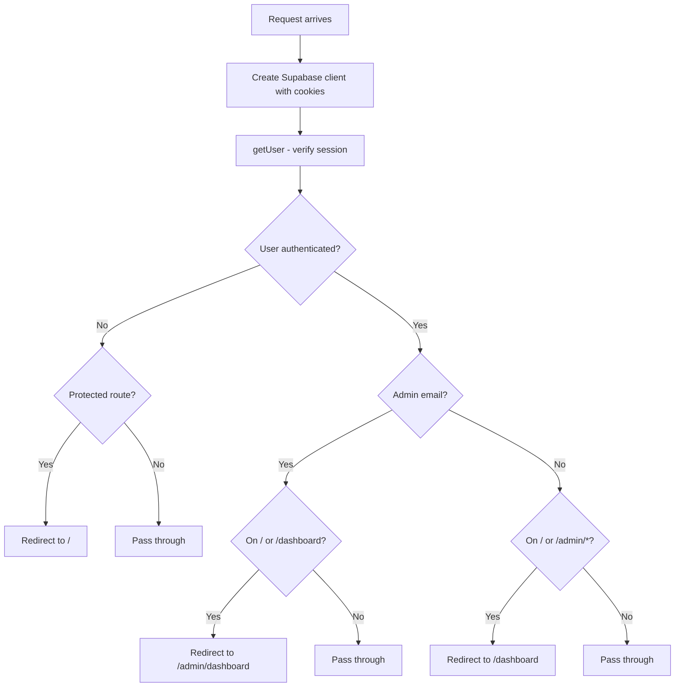

# Middleware

**File:** `middleware.ts`

## Purpose

Next.js middleware that runs on every matched request to verify authentication and enforce role-based routing. This is the single source of truth for auth redirects — page components should not implement their own redirect logic.

## Matched Routes

```typescript
export const config = {
  matcher: ['/', '/dashboard/:path*', '/admin/:path*'],
};
```

## Routing Rules

| Condition | Action |
|-----------|--------|
| Not logged in + accessing `/dashboard` or `/admin/*` | Redirect to `/` |
| Admin + on `/` or `/dashboard` | Redirect to `/admin/dashboard` |
| Non-admin + on `/` or `/admin/*` | Redirect to `/dashboard` |

## Admin Detection

Admin status is determined by exact email match:

```typescript
const isAdminEmail = normalizedEmail === 'priya.dhanani@creolestudios.com';
```

The email is normalized (lowercase + trimmed) before comparison.

## Session Verification

Uses `supabase.auth.getUser()` (not `getSession()`) for secure server-side verification. The `getUser()` method makes a request to the Supabase Auth server to validate the JWT, while `getSession()` only reads the local JWT without verification.

## Cookie Handling

The middleware creates a Supabase server client with custom cookie handling:
- Reads all cookies from the incoming request
- Sets cookies on both the request (for downstream handlers) and the response
- All cookies use `SameSite=none`, `Secure=true`, `path=/`

## Redirect Helper

A custom `redirect()` function ensures cookies set during session refresh are preserved when issuing redirects (cookies from the response are copied to the redirect response).

## Flow Diagram


