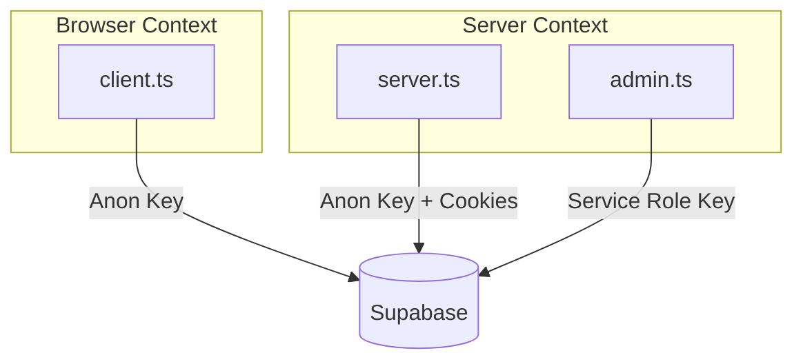

# Supabase Clients

**Directory:** `lib/supabase/`

The project uses three distinct Supabase client factories, each scoped to a specific execution context and privilege level.

## Client Overview



## Browser Client (`client.ts`)

**Usage:** Client components (`'use client'`)

```typescript
import { createClient } from '@/lib/supabase/client';
const supabase = createClient();
```

- Uses `createBrowserClient` from `@supabase/ssr`
- Configured with `NEXT_PUBLIC_SUPABASE_URL` and `NEXT_PUBLIC_SUPABASE_ANON_KEY`
- Cookie options: `SameSite=none`, `Secure=true`
- Falls back to placeholder values if env vars are missing (for build compatibility)

## Server Client (`server.ts`)

**Usage:** Server Components, Route Handlers, Server Actions

```typescript
import { createClient } from '@/lib/supabase/server';
const supabase = await createClient();
```

- Uses `createServerClient` from `@supabase/ssr`
- Reads/writes cookies via `next/headers` cookie store
- Configured with `NEXT_PUBLIC_SUPABASE_URL` and `NEXT_PUBLIC_SUPABASE_ANON_KEY`
- Cookie options: `SameSite=none`, `Secure=true`
- Async function (awaits `cookies()`)

## Admin Client (`admin.ts`)

**Usage:** Server-side only — admin operations requiring elevated privileges

```typescript
import { supabaseAdmin } from '@/lib/supabase/admin';
```

- Uses `createClient` from `@supabase/supabase-js` directly (not SSR variant)
- Configured with `NEXT_PUBLIC_SUPABASE_URL` and `SUPABASE_SERVICE_ROLE_KEY`
- Throws error if `SUPABASE_SERVICE_ROLE_KEY` is missing
- Provides access to `auth.admin.*` methods (e.g., `listUsers()`)
- **Never import this in client components**

## Security Rules

| Client | Can access auth.admin? | Exposed to browser? | Key type |
|--------|----------------------|---------------------|----------|
| Browser | No | Yes | Anon (public) |
| Server | No | No | Anon (public) |
| Admin | Yes | No | Service Role (secret) |
