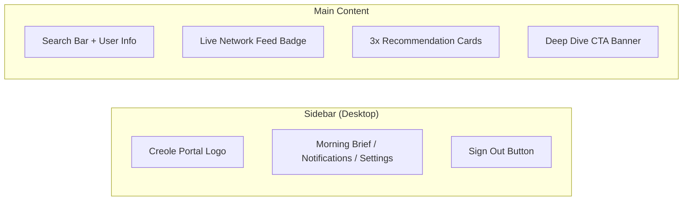

# User Dashboard

**File:** `app/dashboard/page.tsx`
**Type:** Client Component (`'use client'`)

## Purpose

The main view for authenticated non-admin users. Displays a "Morning Briefing" with personalized blog recommendations and a sidebar navigation.

## UI Structure

## Key Behaviors

- **Auth check:** Verifies user session on mount; redirects to `/` if unauthenticated
- **Loading state:** Full-screen spinner while verifying session
- **Recommendation cards:** Currently placeholder content (3 static cards)
- **Responsive:** Sidebar hidden on mobile, full layout on desktop
- **Search bar:** UI present but non-functional (placeholder)

## Dependencies

- `@/lib/supabase/client` — Browser Supabase client
- `@/components/logout-button` — Sidebar sign-out button
- `motion/react` — Animations
- `lucide-react` — Icons

## State

| State | Type | Purpose |
|-------|------|---------|
| `user` | any | Current authenticated user object |
| `loading` | boolean | Session verification in progress |

## Current Limitations

- Recommendation cards are static placeholders
- Search functionality not implemented
- Notifications and Settings nav items are non-functional
- No real data fetching from Gemini AI yet
