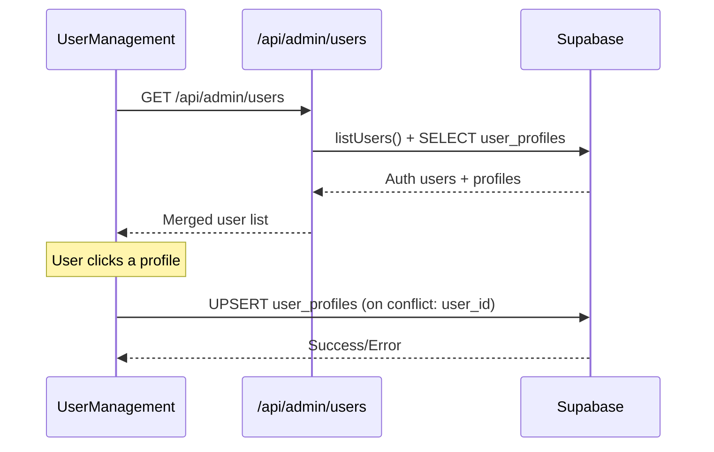

# User Management

**File:** `components/user-management.tsx`
**Type:** Client Component (`'use client'`)

## Purpose

Admin-only component for viewing and editing user profiles. Embedded within the [[admin-dashboard]] as the "Users" tab content.

## UI States

### User List View

- Searchable list of all non-admin users
- Shows profile completion status (complete/incomplete)
- Displays last updated date
- Click to open profile editor

### Profile Editor View

- Form to edit user profile fields
- Tag-based input for tech stacks (Enter or comma to add)
- Save/Cancel actions with toast feedback
- Back button to return to list

## Data Flow

## Profile Fields

| Field | Type | Input Method |
|-------|------|-------------|
| `current_role` | string | Text input |
| `years_of_experience` | number | Number input |
| `primary_tech_stack` | string[] | Tag input (Enter/comma) |
| `secondary_tech_stack` | string[] | Tag input (Enter/comma) |
| `future_interests` | string | Textarea |

## Profile Completeness

A profile is considered "complete" when:
- `years_of_experience` is not null
- `primary_tech_stack` has at least one entry

## Dependencies

- `@/lib/supabase/client` — Browser Supabase client (for upsert)
- `motion/react` — List/form transition animations
- `lucide-react` — Icons (User, Mail, Search, Save, Loader2, etc.)

## State

| State | Type | Purpose |
|-------|------|---------|
| `users` | UserProfile[] | All fetched users |
| `loading` | boolean | Initial fetch in progress |
| `selectedUser` | UserProfile \| null | Currently editing user |
| `searchQuery` | string | Filter users by email/interests |
| `saving` | boolean | Save operation in progress |
| `toast` | object \| null | Success/error feedback |
| `formData` | object | Profile edit form state |
| `primaryTechInput` | string | Current tag input value |
| `secondaryTechInput` | string | Current tag input value |
