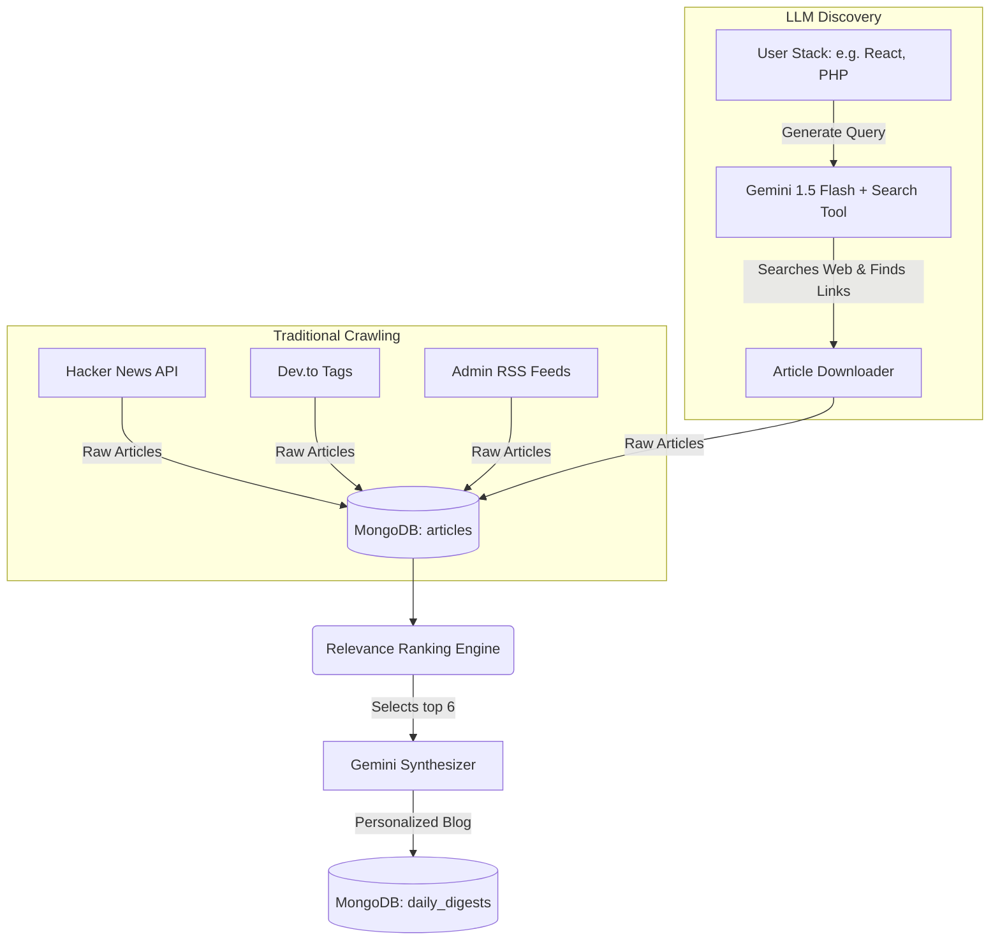

# 🚀 Implementation Plan: LLM-Driven Blog Fetching & Discovery

This document details the step-by-step implementation plan to incorporate **Method 2: LLM-Driven Web Search & Discovery** into our tech portal's blog gathering pipeline, complementing the traditional scraping methods.

---

## 🧭 The Core Objective

To build a hybrid data-fetching system that utilizes both traditional scraping and real-time AI-guided web discovery to populate our MongoDB `articles` database collection:

1. **Method 1 (Traditional Scrapers)**: Hacker News, Dev.to tags, and RSS feeds.
2. **Method 2 (AI Web Finder)**: Queries Google Gemini (with Google Search Grounding) to discover fresh web posts based on the user's customized technology profile, downloads their raw content, and caches them in MongoDB.

---

## 🎨 System Architecture



---

## 📋 Step-by-Step Implementation Steps

### 1. Model Selections & Cost Optimization (100% Free)
We will utilize the **Google AI Studio Free Tier** to eliminate all API hosting and operational costs:

* **Discovery & Search**: `gemini-1.5-flash` with the `google_search` tool enabled (Free grounding, up to 1,500 requests/day).
* **Semantic Indexing**: `text-embedding-004` (Free vector embeddings, up to 1,500 requests/day).
* **Final Curation & Synthesis**: `gemini-2.5-flash` (Lightning fast markdown generation).

---

### 2. File and Code Structure

We will introduce a new module: `fetch-blogs/src/scrapers/llm_searcher.py`.

#### Draft Implementation (`llm_searcher.py`):
```python
import logging
import google.generativeai as genai
from src.config import settings
from src.models.schemas import UserProfile, Article
from datetime import datetime

logger = logging.getLogger(__name__)

if settings.GEMINI_API_KEY:
    genai.configure(api_key=settings.GEMINI_API_KEY)

async def search_trending_articles_via_gemini(user: UserProfile) -> list[Article]:
    """
    Uses Gemini with Google Search tool grounding to discover trending articles
    matching the user's specific developer profile and stack.
    """
    if not settings.GEMINI_API_KEY:
        logger.warning("Gemini API key missing. Skipping LLM Web Search.")
        return []

    # 1. Build a highly customized search query
    tech_keywords = ", ".join(user.primary_tech_stack[:3] + user.interests[:2])
    query = f"Find top trending articles, tutorials, or deep-dives about {tech_keywords} published in the last 7 days."

    logger.info(f"Querying Gemini Search Grounding with: {query}")
    try:
        # 2. Configure Gemini with the Google Search Tool
        model = genai.GenerativeModel(
            model_name="gemini-1.5-flash",
            tools=[{"google_search": {}}]
        )
        response = model.generate_content(query)
        
        # 3. Extract grounding metadata (organic search result URLs)
        # 4. Return list of raw Article objects to be extracted/downloaded...
        # ...
    except Exception as e:
        logger.error(f"Gemini search grounding failed: {e}")
        return []
```

---

### 3. Modifying the Pipeline Coordinator

We will integrate this searcher into `fetch-blogs/src/hybrid/coordinator.py`:

```diff
# fetch-blogs/src/hybrid/coordinator.py

  # 2. Scrape articles
  logger.info("Gathering articles across all channels...")
  all_scraped: list[Article] = []
  scraped_sources = []
  
+ # Method 2: Discover articles via LLM Web Finder
+ try:
+     ai_discovered_items = await search_trending_articles_via_gemini(user)
+     all_scraped.extend(ai_discovered_items)
+ except Exception as e:
+     logger.error(f"LLM Search discovery failed: {e}")
```

---

### 4. Database Schema Upgrades
We will add `strategy_source` and `ai_summary` fields in MongoDB `articles` collection to clearly differentiate where articles came from:
* `strategy_source = "Scraped"` (For traditional scraper fetches).
* `strategy_source = "LLM-Search"` (For AI search-discovered fetches).
