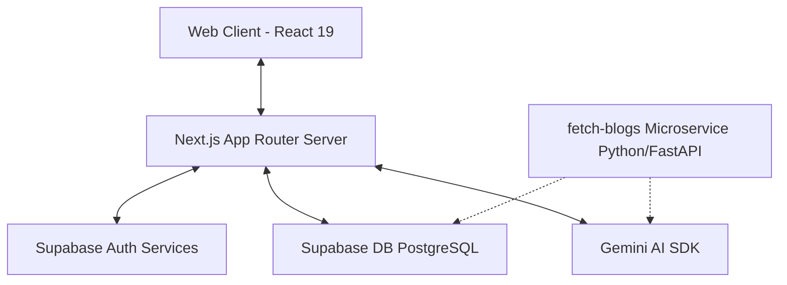
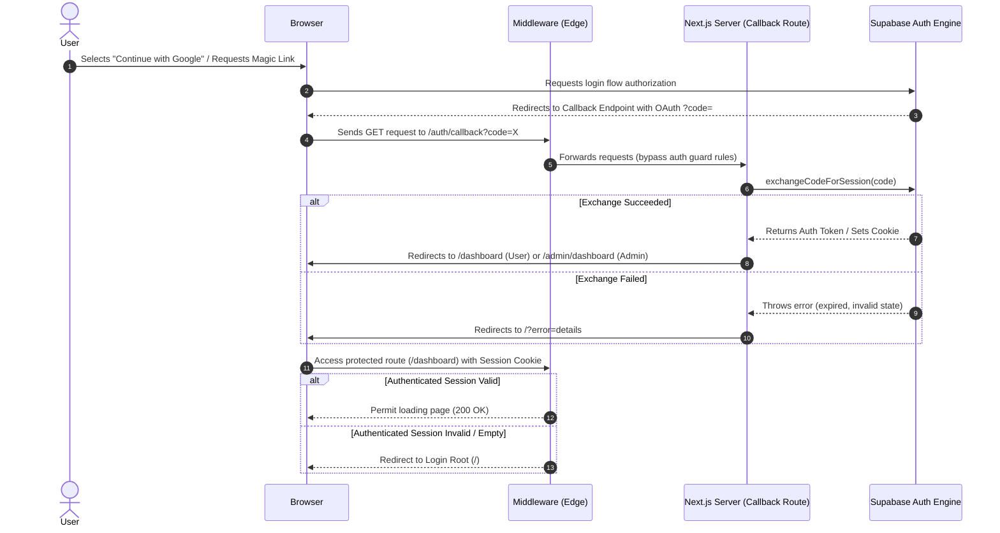
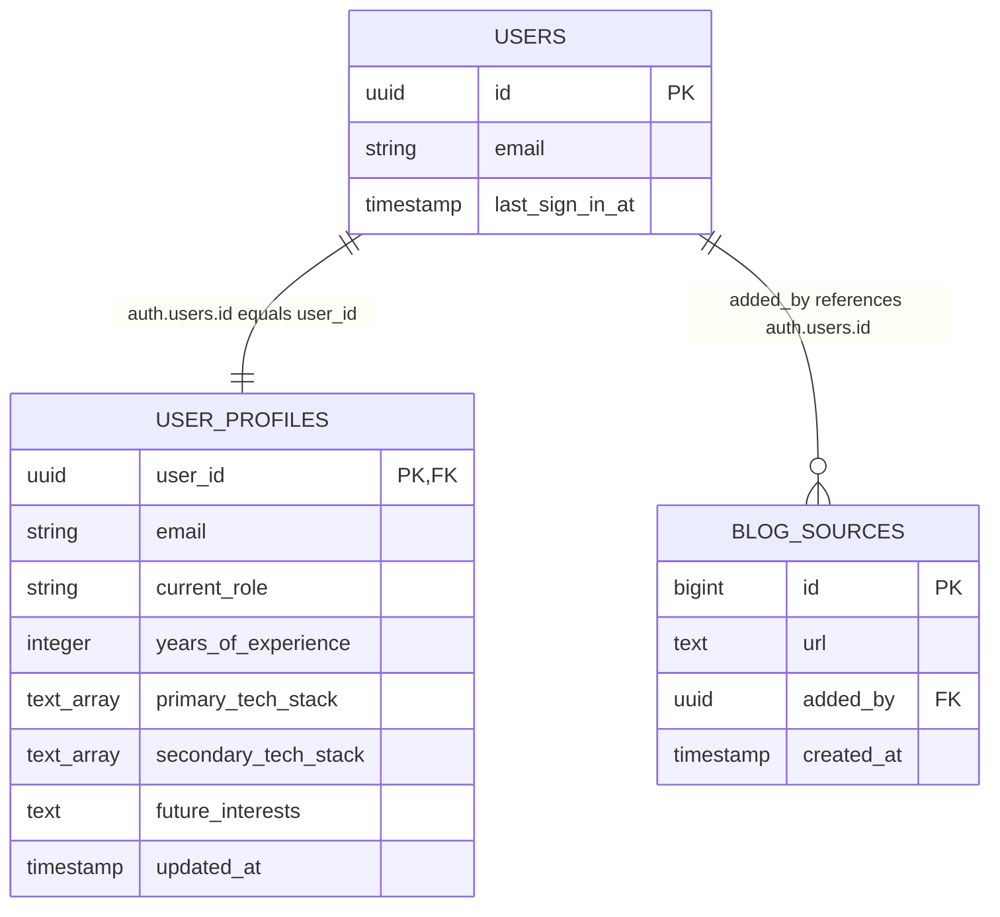

# System Architecture

This document details the software architecture, database design, and critical process flows of the **Creole Knowledge Portal**.

---

## 🏗️ Architectural Overview

The Creole Knowledge Portal is architected using a modern web application structure:

1. **Frontend / BFF (Backend for Frontend)**: Next.js 15 (App Router) executing React 19 Client and Server Components.
2. **Authentication & Database**: Supabase serves as the backend infrastructure, handling passwordless authentication (Magic Link), Google OAuth, and structured data storage (PostgreSQL).
3. **Blog Crawler & Synthesis Service**: A separate Python microservice (`fetch-blogs`) built with FastAPI. It scrapes Dev.to / Hacker News / RSS, extracts bodies (newspaper3k + Jina), ranks with TF-IDF + Gemini embeddings, synthesizes a daily briefing, and stores it in MongoDB. Next.js reads that JSON via `lib/blog-service.ts`. See [[pages/fetch-blogs-walkthrough.md|Fetch Blogs walkthrough]].

---

## ☁️ Deployment & Infrastructure

Production runs on **AWS ECS Fargate**, managed by a Pulumi stack (`dev`). **Data stores are external SaaS only** — no RDS, DocumentDB, or ElastiCache in AWS (Supabase, MongoDB Atlas, and Redis are outside the VPC).

| Item | Value |
|------|-------|
| AWS account | `715736407442` (`cloud_user` profile) |
| Region | `us-east-1` |
| Pulumi backend | `s3://pulumi-state-715736407442` |
| ECS cluster | `ckp-shared` — web (:3000), api (:8000), Celery workers |
| Task size | 1024 CPU / 2048 MiB |
| Live URL | https://ckp.nikcreations.com/creole-knowledge-portal/ |
| Base path | `/creole-knowledge-portal` (via `NEXT_PUBLIC_BASE_PATH`) |

The root `Dockerfile` builds a Next.js standalone image. The `npm run build` step sets `NODE_OPTIONS=--max-old-space-size=4096` to avoid OOM during compilation. Server secrets (`SUPABASE_SERVICE_ROLE_KEY`, `GEMINI_API_KEY`, etc.) are **not** baked into the image — placeholders are used at build time; real values are injected at ECS runtime via AWS Secrets Manager (Pulumi config → Secrets Manager → task `secrets`).

As of the 2026-08-22 redeploy, only the **web** service is scaled up (`webDesiredCount=1`); api and workers remain at `0` until images and external-store secrets are configured.

See [[logs/2026-08-22|2026-08-22 changelog]] for redeploy details and [[logs/2026-08-11|2026-08-11 changelog]] for earlier infra wiring.

---

## 🔒 Authentication & Routing Flow

Application routing and security checkpoints are enforced at the Edge using Next.js Middleware. Security is not delegated directly to rendering components; instead, requests are verified during the HTTP traversal lifecycle.

### User Roles

- **Standard User**: Authenticated employees who access `/dashboard` to view their morning blog feeds and role-specific technical briefings.
- **Administrator**: Hardcoded to `priya.dhanani@creolestudios.com`. Administrators bypass normal routing to reach `/admin/dashboard`, where they configure blog feeds and manage user tags.

### Authentication Sequence Diagram

The diagram below details the OAuth callback loop:

---

## 🗄️ Database Design

The database layers are hosted inside Supabase. Currently, the system uses two main custom tables in the PostgreSQL public schema:

### 1. Table: `user_profiles`

Maintains user details, role designations, experience metrics, and technical interests. This is used by the recommendation engine to fetch specialized documents.

### 2. Table: `blog_sources`

Tracks target web feeds configured by administrators to extract morning technical articles.

### Entity Relationship Diagram (ERD)

---

## 📂 Codebase Folder Structure

- `app/`: Contains Next.js Page components, API endpoints, and global styling layouts.
- `components/`: Holds reusable visual UI assets, including `LogoutButton` and `UserManagement`.
- `lib/`: Houses database connection initialization factories (`lib/supabase/`).
- `infra/`: Pulumi stack — ECS Fargate platform, Secrets Manager, Route53/ACM (see Deployment section above).
- `scripts/`: Quality assurance verification pipelines and CI check simulations.
- `fetch-blogs/`: FastAPI + Celery microservice (Mongo, Redis, Gemini). Walkthrough: [[pages/fetch-blogs-walkthrough.md]].
