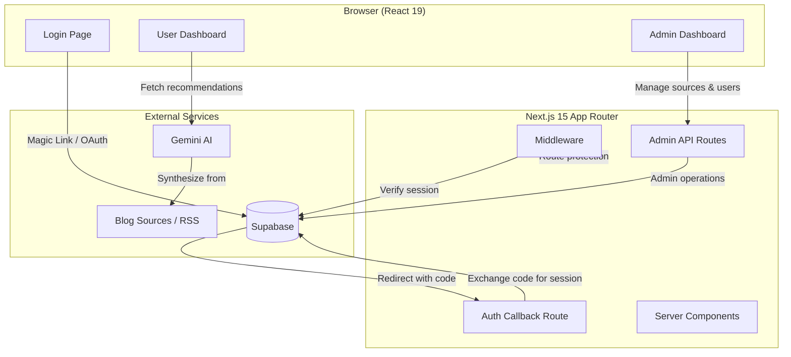
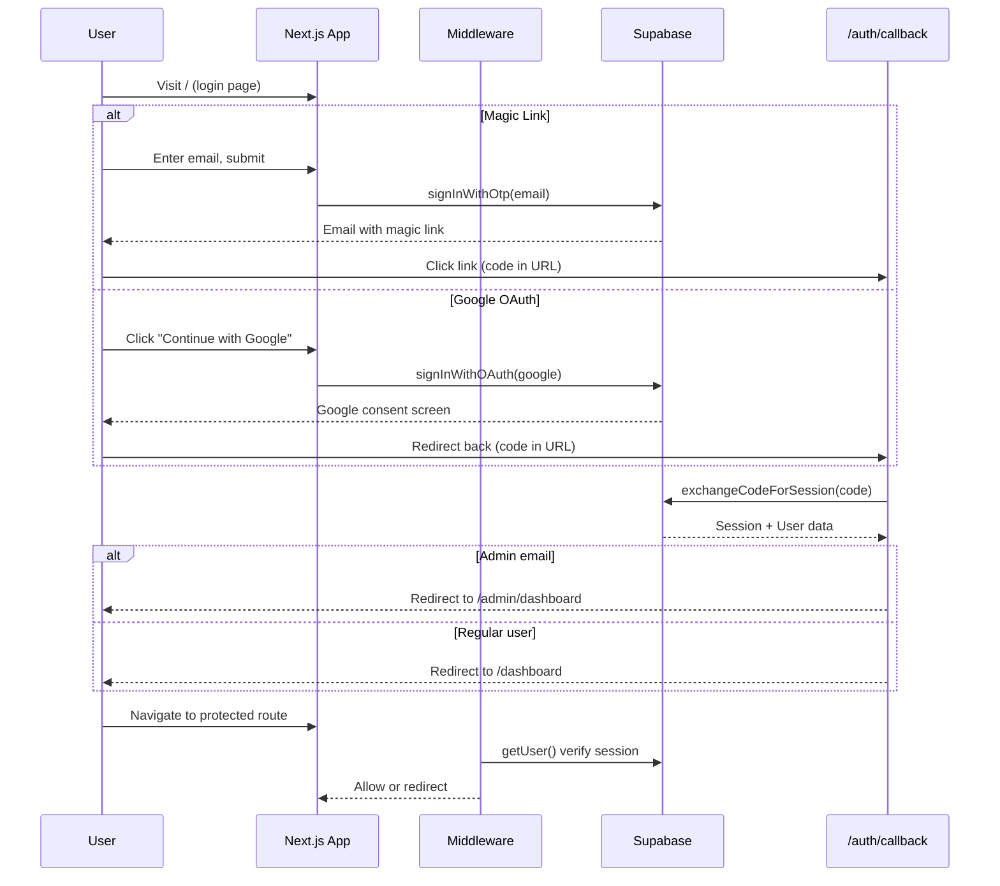
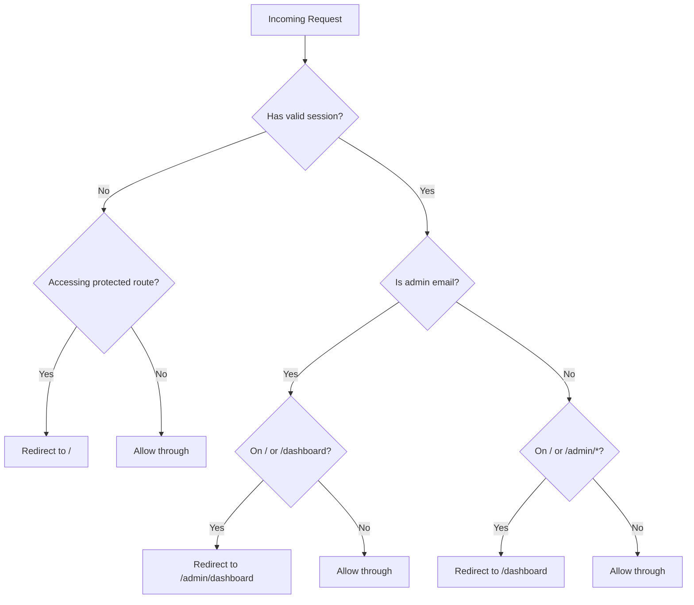
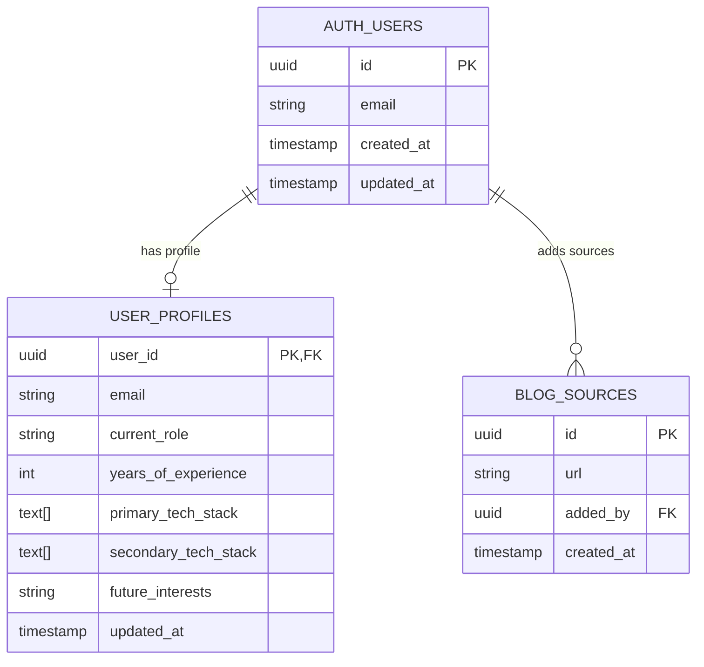

# Architecture

## Overview

The Creole Knowledge Portal is a Next.js 15 application using the App Router pattern. It combines Supabase for authentication and data persistence with Google Gemini AI for content synthesis. The application follows a server-first component model with client components used only where interactivity is required.

## High-Level System Diagram



## Authentication Flow



## Middleware Routing Logic



## Data Model



## Technology Stack

| Layer | Technology | Version |
|-------|-----------|---------|
| Framework | Next.js (App Router) | ^15.4.9 |
| UI Library | React | ^19.2.1 |
| Language | TypeScript | 5.9.3 |
| Styling | Tailwind CSS | 4.1.11 |
| Animation | Motion (Framer Motion) | ^12.23.24 |
| Auth & DB | Supabase | ^2.105.1 |
| SSR Auth | @supabase/ssr | ^0.10.2 |
| AI | @google/genai (Gemini) | ^1.17.0 |
| Icons | Lucide React | ^0.553.0 |
| Forms | @hookform/resolvers | ^5.2.1 |
| Utilities | clsx, tailwind-merge, class-variance-authority | latest |

## Key Architectural Decisions

- **Server Components by default** — `'use client'` only added when hooks or browser APIs are needed
- **Middleware-based auth routing** — no auth redirects inside page components
- **Three Supabase clients** — browser (`client.ts`), server (`server.ts`), admin (`admin.ts`) for appropriate privilege levels
- **Standalone output** — enables Docker/Cloud Run deployment without a Node.js server dependency on the full `node_modules`
- **Cookie config: SameSite=none, Secure=true** — required for cross-origin Cloud Run deployments

## Folder Architecture

```
├── app/
│   ├── layout.tsx              # Root layout (Inter font, metadata)
│   ├── page.tsx                # Login page (client component)
│   ├── globals.css             # Tailwind + custom theme tokens
│   ├── dashboard/page.tsx      # User morning briefing
│   ├── admin/dashboard/page.tsx # Admin console (sources + users)
│   ├── auth/callback/route.ts  # OAuth/OTP callback handler
│   └── api/admin/users/route.ts # Admin user listing API
├── components/
│   ├── logout-button.tsx       # Reusable sign-out button
│   └── user-management.tsx     # Admin user profile editor
├── lib/
│   ├── supabase/
│   │   ├── client.ts           # Browser Supabase client
│   │   ├── server.ts           # Server Supabase client
│   │   └── admin.ts            # Service-role admin client
│   ├── utils.ts                # cn() utility (clsx + twMerge)
│   └── sanity.test.ts          # Vitest sanity check
├── middleware.ts               # Auth + route protection
├── scripts/ci-test.sh          # Local quality gate script
└── next.config.ts              # Next.js configuration
```
