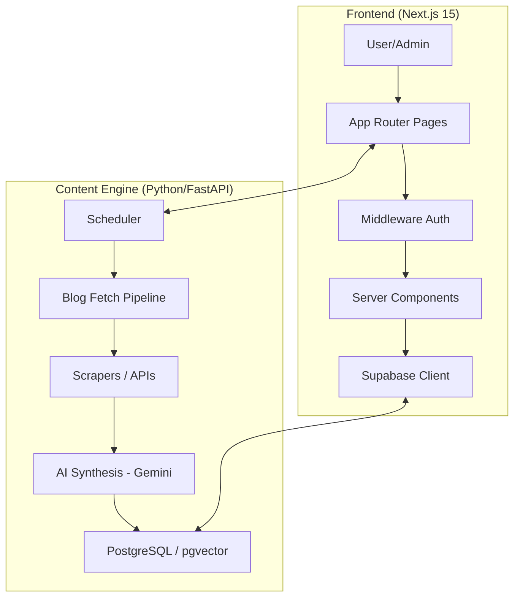

# Architecture Overview

The Creole Knowledge Portal is a modern full-stack application designed to deliver curated technical content to users daily. It leverages a hybrid approach of traditional scraping and AI synthesis to generate high-quality digests.

## 🏗️ System Design

### High-Level Architecture
The system is split into two primary domains: the **Next.js Frontend** (UI and User Management) and the **Blog Fetch Module** (Python/FastAPI service for content acquisition and synthesis).

### Technical Stack
- **Frontend**: Next.js 15 (App Router), React 19, TypeScript, Tailwind CSS 4.
- **Backend (Content Engine)**: Python, FastAPI, Pydantic v2.
- **Database/Auth**: Supabase (PostgreSQL + pgvector), Supabase Auth.
- **AI**: Google Gemini 2.0 Flash (with Ollama fallback).
- **Infrastructure**: Vercel (Frontend), Docker/VPS (Python Service).

## 🔄 Data Flow

### Digest Generation Pipeline
1. **User Profile**: The system retrieves the user's tech interests and preferences.
2. **Content Acquisition**:
    - **Strategy A**: RSS feeds, Dev.to, Reddit APIs.
    - **Strategy B**: Semantic crawling via Crawl4AI/Jina.
    - **Strategy C (Hybrid)**: Strategy A fetch + Strategy B ranking.
3. **Synthesis**:
    - Content is deduplicated and clustered.
    - Gemini 2.0 Flash synthesizes a comprehensive digest (3,750–5,000 words).
    - The result is stored in the `daily_digests` table.
4. **Delivery**: The Next.js dashboard fetches the latest digest via the FastAPI endpoint `/api/digests/{user_id}/latest`.

### Authentication Flow
- **Magic Link (OTP)**: Supabase handles the email OTP flow.
- **Google OAuth**: Integrated for seamless corporate login.
- **Admin Access**: Gated via an exact email match (`priya.dhanani@creolestudios.com`) in `middleware.ts`.

## 📂 Folder Structure
- `app/`: Next.js App Router pages and API routes.
- `components/`: Shared React components.
- `lib/supabase/`: Supabase client factories (browser, server, admin).
- `fetch-blogs/`: The Python/FastAPI synthesis engine.
- `scripts/`: CI/CD and database inspection utilities.
