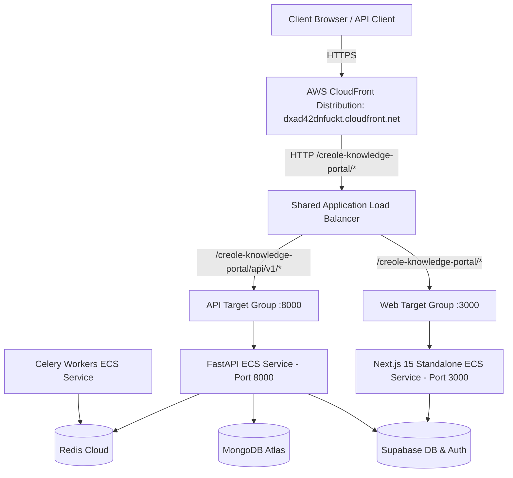

# AWS ECS & Pulumi Deployment Guide

This document provides complete operational and architectural documentation for the **Creole Knowledge Portal** deployment on AWS ECS Fargate orchestrated via Pulumi.

---

## 1. Architecture Overview

---

## 2. Infrastructure Details

| Component | Resource Details |
| :--- | :--- |
| **AWS Region** | `us-east-1` |
| **AWS Account ID** | `642024554221` (Sandbox Account) |
| **Pulumi Org/Stack** | `YashCreole/creole-knowledge-portal/dev` |
| **CloudFront Distribution** | `dxad42dnfuckt.cloudfront.net` |
| **ECS Cluster** | `ckp-shared` |
| **Application Load Balancer** | `ckp-shared-alb-27687108.us-east-1.elb.amazonaws.com` |
| **ECR Repositories** | `642024554221.dkr.ecr.us-east-1.amazonaws.com/creole-knowledge-portal-*` |
| **CloudWatch Log Group** | `creole-knowledge-portal-logs-b8272d8` |

---

## 3. Endpoints (CloudFront HTTPS)

The application is deployed behind an AWS CloudFront distribution terminating TLS and forwarding requests to the ALB:

- **Web Application (CloudFront HTTPS)**:
  `https://dxad42dnfuckt.cloudfront.net/creole-knowledge-portal`
- **FastAPI Liveness Health Check**:
  `https://dxad42dnfuckt.cloudfront.net/creole-knowledge-portal/api/v1/health/live`
- **FastAPI Full Readiness Probe**:
  `https://dxad42dnfuckt.cloudfront.net/creole-knowledge-portal/api/v1/health/ready`
- **Direct ALB HTTP Fallback**:
  `http://ckp-shared-alb-27687108.us-east-1.elb.amazonaws.com/creole-knowledge-portal`

---

## 4. Container Configuration

1. **Next.js Web**:
   - Multi-stage Docker build utilizing Next.js `output: 'standalone'`.
   - Base path configured via `basePath: '/creole-knowledge-portal'` and `assetPrefix: '/creole-knowledge-portal'`.
2. **FastAPI Backend**:
   - Python 3.11 with `uv` package manager.
   - Dual route mounting (`/api/v1` and `/creole-knowledge-portal/api/v1`) for local and ALB compatibility.
   - MongoDB Atlas TLS configured with `certifi.where()`.
3. **Celery Worker**:
   - Prefork concurrency connected to Redis queue for background blog scraping and AI synthesis.
