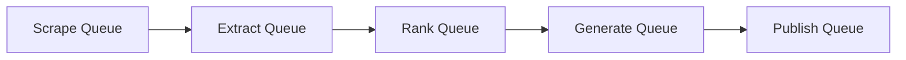

# Blog Fetch & Digest Generation System - Developer Handoff

This document provides a comprehensive technical overview of the Blog Fetch and Digest Generation module. It is intended for developers working on or maintaining the `fetch-blogs` microservice and its Next.js integration.

## 🏗️ High-Level Architecture Flow

When a user interacts with the system to generate or fetch a daily blog (digest), the system utilizes a Celery-backed Python pipeline that handles everything asynchronously.

### The Trigger (Next.js & FastAPI)
- **Manual Trigger**: A request is sent to `/pipeline/trigger` with a `user_id`.
- **Cron Trigger**: A background job automatically runs the pipeline daily.
- **Profile Sync**: Before the pipeline starts, `upsert_mongo_profile(user_id)` fetches the source-of-truth developer profile from **Supabase** and caches it in **MongoDB** (`user_profiles`). This includes the user's role, experience, tech stack, and interests.

---

## 🐍 Python FastAPI Service (`/fetch-blogs`)

The dedicated Python microservice uses a **5-queue Celery chain** (`scrape → extract → rank → generate → publish`) to handle asynchronous data collection, AI embeddings, and complex ranking algorithms without blocking the Next.js frontend.

### Internal Microservice Flow (Celery Pipeline)



#### 1. Scrape Queue (`src/workers/scraper_tasks.py`)
Fetches raw candidate links based on the user's tags and stack. **Note: This phase relies purely on structured APIs and Feeds, not raw HTML scraping.**
- **Dev.to**: Calls the official Dev.to API (`/api/articles`) filtering by the user's tech stack tags.
- **Hacker News**: Uses the official Hacker News Firebase API to grab top stories.
- **Custom RSS Feeds**: Uses `feedparser` to parse XML feeds manually registered by admins.
- *Output*: A list of basic Article objects containing URLs, Titles, and publication dates.

#### 2. Extract Queue (`src/workers/extractor_tasks.py`)
Performs the actual "Deep Web Scraping" only on the discovered URLs.
- **Jina Reader**: Used to extract the clean Markdown body text of the articles.
- **Fallback**: If Jina fails, it falls back to `newspaper3k` to parse the main article text.
- *Output*: Article objects enriched with `body_text` and `word_count`.

#### 3. Rank Queue (`src/workers/ranker_tasks.py` & `src/ai_pipeline/reranker.py`)
Filters and selects the best articles using a two-pass AI ranking engine:
- **Pass 1: Semantic Ranking (Cosine Similarity)**
  - Creates a text string of the user's profile (Role, Stack, Experience).
  - Uses a vector embedding model to create an "AI fingerprint" for the profile and for each candidate article's snippet.
  - Sorts candidates by **Cosine Similarity** to find the closest thematic matches.
- **Pass 2: LLM Re-ranking (Gemini)**
  - Passes the top semantically ranked candidates to the **Gemini LLM** (`gemini-3.6-flash`, fallback to `gemini-2.5-flash`).
  - Gemini acts as a senior technical curator and selects the absolute best **10** articles for the user.
- *Output*: The top 10 highly relevant Article IDs.

#### 4. Generate Queue (`src/workers/generator_tasks.py`)
- The full text of the top 10 articles is passed back to the Gemini LLM.
- The LLM writes a personalized **Daily Digest** formatted in Markdown. It structures the blog into sections: Daily Overview (TL;DR), Brief, Code Snippet, Overview / Summary, and Key Actionables.

#### 5. Publish Queue (`src/workers/publisher_tasks.py`)
- The synthesized Daily Digest and the cached original articles are permanently saved into **MongoDB** (`daily_digests` and `articles` collections).

---

## 💻 Presentation (The Next.js Frontend)

When the user logs into the Creole Knowledge Portal:
1. The Next.js dashboard hits the `/digests/{user_id}/latest` (or `/past`) API endpoint on the FastAPI server.
2. The endpoint reads the fully formed Markdown digest from **MongoDB** and flattens it into a frontend-friendly shape.
3. The UI renders the AI digest at the top and lists the sources/citations beautifully as interactive cards.

---

## 🛠️ Developer Setup & Commands

If you are picking up work on the `fetch-blogs` service, you will need Docker running locally for Mongo/Redis.

```bash
# Navigate to the service
cd fetch-blogs

# 1. Install dependencies
uv sync

# 2. Start infra (MongoDB + Redis)
docker compose up -d

# 3. Run FastAPI in Dev Mode (Hot reload)
uv run fastapi dev src/main.py

# 4. Run Celery Workers (Required for the pipeline to process jobs)
uv run celery -A src.workers.celery_app worker -l info
```

### Quality Control Standards
- **Strict Typing:** All Python code must use type hints.
- **Linting:** Use `uv run ruff check src --fix`.
- **Database queries:** Never write raw motor queries; always use `Beanie` ODM objects.
- **Asynchronous queues:** The pipeline passes lists of IDs (strings) between Celery tasks, not raw massive text payloads, to keep Redis memory footprint low.
