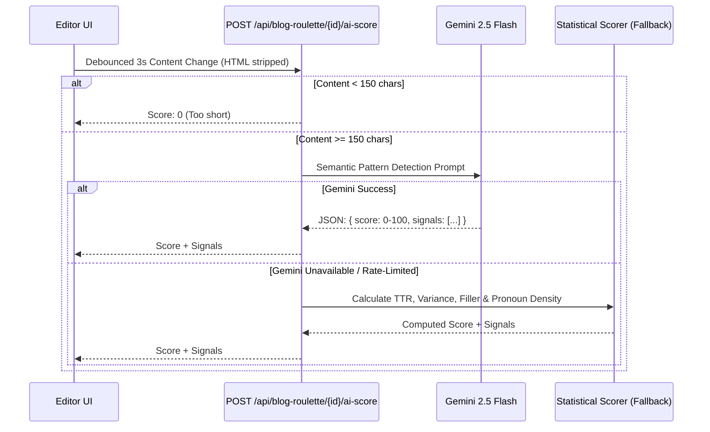
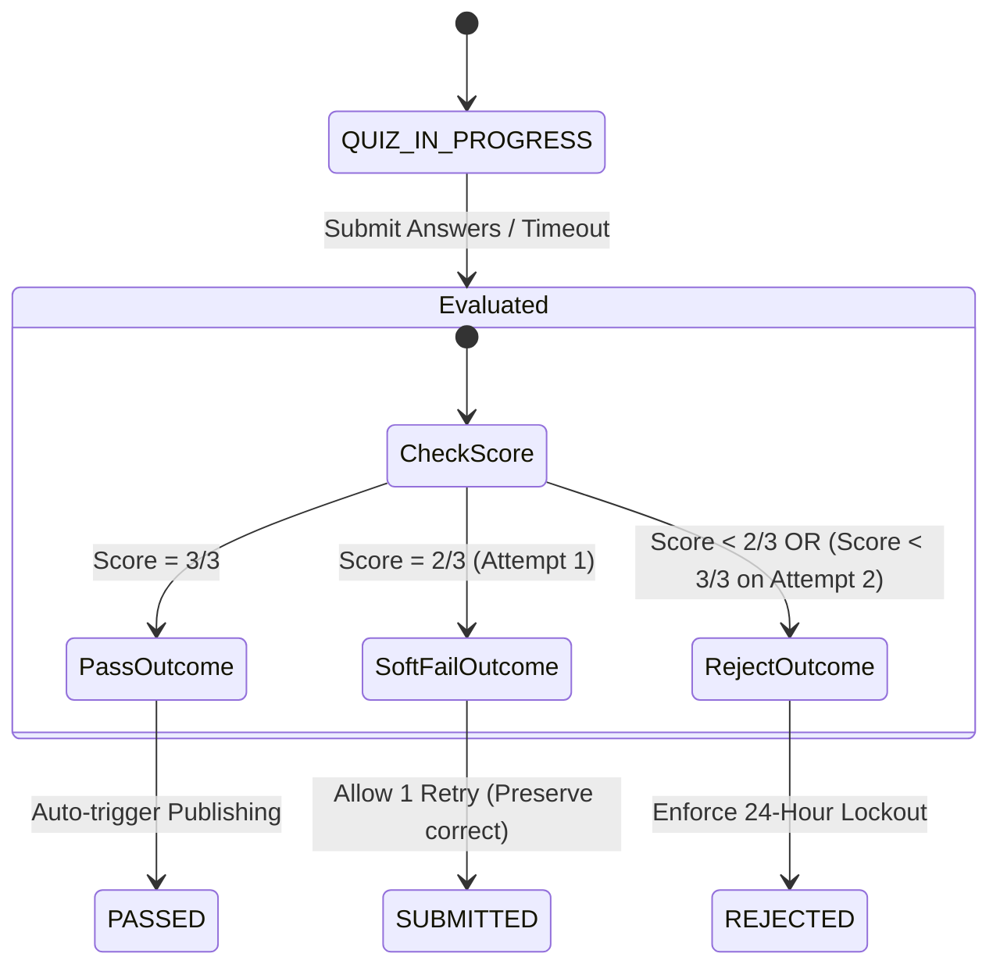

# Blog Write & Synthesis Module — Technical Architecture & Step-by-Step Guide

This document is the authoritative engineering specification and operational walkthrough for the **Blog Write Module** within the **Creole Knowledge Portal**.

The system features two interconnected dimensions of blog creation:
1. **The Interactive Authoring & Publishing Module ("Blog Roulette")**: A collaborative, gamified authoring platform where human developers research SEO keywords, write technical articles in TinyMCE, undergo real-time AI content detection and strict pre-submit checkpoints, verify authorship via an anti-AI comprehension quiz, sync to Google Drive as native Google Docs, and earn leaderboard badges.
2. **The Automated AI Blog Synthesis Engine ("Blog Compiler & Microservice Generator")**: An autonomous pipeline that crawls external tech feeds via Jina Reader, extracts and sanitizes content, re-ranks articles against employee tech stack profiles, synthesizes in-depth masterclass tutorials, and semantically splits them into 20-minute daily learning chapters.

---

## 1. High-Level Architecture Overview

```mermaid
flowchart TD
    subgraph Dimension 1: Interactive Blog Authoring (Blog Roulette)
        A1[Author: Propose Title] --> A2[SEO Discovery: Google Suggest + Trends]
        A2 --> A3[Draft in TinyMCE WYSIWYG]
        A3 --> A4[Real-time AI Detector: Gemini Flash + Heuristic]
        A4 --> A5[Pre-Submit Checkpoints Validation]
        A5 --> A6[Submit: Anti-AI Authorship Quiz]
        A6 -->|Score = 3/3| A7[Status: PASSED]
        A6 -->|Score = 2/3| A8[SOFT_FAIL: 1 Retry Allowed]
        A6 -->|Score < 2/3 or Retry Fail| A9[Status: REJECTED: 24h Lockout]
        A7 --> A10[Publish Pipeline: Google Drive + Leaderboard]
    end

    subgraph Dimension 2: Automated AI Blog Compiler & Generator
        B1[Raw Web Source URL] --> B2[Ingestion: Jina Reader API / Direct Fetch]
        B2 --> B3[Extraction & Noise Stripping: Gemini 2.5 Flash]
        B3 --> B4[Profile-Aware Re-ranking: User Stack Matching]
        B4 --> B5[Masterclass Tutorial Synthesis: Gemini Pro/Flash]
        B5 --> B6[WPM Speed Calculation: Prose vs Code]
        B6 --> B7[Semantic 20-Min Daily Chunking]
    end
```

---

## 2. Interactive Blog Authoring Module (Blog Roulette) — Step-by-Step Workflow

Located across:
- **Frontend UI**: [`app/blog-roulette/new/page.tsx`](file:///var/www/html/creole-knowledge-portal/app/blog-roulette/new/page.tsx), [`app/blog-roulette/[id]/edit/page.tsx`](file:///var/www/html/creole-knowledge-portal/app/blog-roulette/[id]/edit/page.tsx), [`app/blog-roulette/[id]/quiz/page.tsx`](file:///var/www/html/creole-knowledge-portal/app/blog-roulette/[id]/quiz/page.tsx)
- **Shared Components**: [`components/blog-roulette/checklist-sidebar.tsx`](file:///var/www/html/creole-knowledge-portal/components/blog-roulette/checklist-sidebar.tsx), [`components/blog-roulette/preview-pane.tsx`](file:///var/www/html/creole-knowledge-portal/components/blog-roulette/preview-pane.tsx), [`components/blog-roulette/published-blog-view.tsx`](file:///var/www/html/creole-knowledge-portal/components/blog-roulette/published-blog-view.tsx)
- **API Endpoints**: [`app/api/blog-roulette/`](file:///var/www/html/creole-knowledge-portal/app/api/blog-roulette)
- **Core Library Services**: [`lib/blog-roulette/`](file:///var/www/html/creole-knowledge-portal/lib/blog-roulette)

---

### Step 2.1: Idea Discovery & SEO Keyword Intelligence

When an engineer begins a new blog post at `/blog-roulette/new`:

1. **Title Proposal**: The author enters a working title (minimum 5 characters to request suggestions, minimum 10 characters to create).
2. **Google Autocomplete Ingestion**:
   - Triggered by `/api/blog-roulette/seo-suggest`.
   - Function [`suggestKeywords(title)`](file:///var/www/html/creole-knowledge-portal/lib/blog-roulette/seo.ts#L55-L80) queries Google Autocomplete API:
     ```
     https://suggestqueries.google.com/complete/search?client=firefox&q={title}
     ```
   - Top 3 matches are categorized as `primary` target keywords.
   - Matches 4 through 10 are categorized as `long_tail` keywords.
3. **90-Day Trend Analysis**:
   - For primary keywords, [`fetchTrendDirection(keyword)`](file:///var/www/html/creole-knowledge-portal/lib/blog-roulette/seo.ts#L28-L53) queries `google-trends-api` over the past 90 days.
   - Calculates the average interest delta between the first half and second half of the 90-day window:
     - Delta $> 5$: labeled **`rising`** (visualized with a green arrow).
     - Delta $< -5$: labeled **`falling`** (visualized with a red arrow).
     - Otherwise: labeled **`stable`**.
4. **Draft Initialization**:
   - The user selects which keywords to target.
   - Clicking **"Create Draft & Open Editor"** calls `POST /api/blog-roulette` with `{ title, keywords, suggestions }`.
   - A new row is inserted into `roulette_blogs` with `status: 'DRAFT'`, and selected keywords are written to `roulette_seo_keywords`.
   - The user is redirected to `/blog-roulette/{id}/edit`.

---

### Step 2.2: Rich-Text Drafting, Media Uploads & Metadata

At `/blog-roulette/{id}/edit`:

1. **TinyMCE WYSIWYG Editor**:
   - Configured with clean developer plugins: code blocks (`codesample`), tables, lists, links, image embedding, word count, and undo/redo stacks.
2. **Metadata Formulation**:
   - **SEO Title**: Target length $\le 60$ characters.
   - **Meta Description**: Target length $\le 160$ characters.
   - **TL;DR**: Executive summary $\le 80$ words.
   - **Tags**: Technology tags (minimum 3 required).
   - **Cover Image**: Uploaded via `POST /api/blog-roulette/upload` into Supabase Storage bucket `blog-images` with a 5 MB limit.
3. **Automated Autosave**:
   - Autosave interval runs every 10 seconds if changes are detected, issuing a `PATCH /api/blog-roulette/{id}` with the current state without interrupting the user.

---

### Step 2.3: Real-Time AI Content Detection & Quality Gate

To preserve genuine human engineering insights and prevent raw ChatGPT copy-pastes, the editor incorporates a real-time AI scanning engine in [`lib/blog-roulette/ai-detection.ts`](file:///var/www/html/creole-knowledge-portal/lib/blog-roulette/ai-detection.ts).



#### The Detection Algorithms:
1. **Primary Model (Gemini 2.5 Flash)**:
   - Understands developer writing quirks.
   - **Human Signals (Lowers Score)**: Personal debugging stories, non-standard phrasing, edge-case code mistakes, real library versions, conversational tone.
   - **AI Signals (Increases Score)**: Rigid academic transitions ("Firstly", "Moreover", "In conclusion"), uniform sentence pacing, generic surface recommendations.
2. **Secondary Fallback (Statistical Heuristics)**:
   - Runs if Gemini is unreachable or out of quota:
     - **Lexical Diversity (Type-Token Ratio)**: $TTR = \frac{|\text{unique words}|}{|\text{total words}|}$. Low diversity ($< 0.35$) adds up to $+25$ points.
     - **Sentence-Length Variance**: Computes standard deviation $\sigma$ across sentence lengths. Low variance ($\sigma < 3.5$) indicates robotic rhythm and adds $+20$ points.
     - **Filler & Transition Word Density**: Tracks frequency of classic transition markers (`furthermore`, `moreover`, `additionally`, `consequently`, `thus`, `therefore`). Density $> 5\%$ adds up to $+20$ points.
     - **Personal Pronoun Frequency**: Measures usage of `i`, `we`, `my`, `our`. Absence of personal pronouns in long texts adds $+15$ points.
3. **Quality Thresholds**:
   - `ai_score < 60%`: **Normal / Healthy**.
   - `60% <= ai_score < 80%`: **Warning** (yellow banner advising author to inject personal perspective).
   - `ai_score >= 80%`: **Rejection Barrier** (blocks submission checkpoint).

---

### Step 2.4: Pre-Submission Checkpoints

The author is guided by [`ChecklistSidebar`](file:///var/www/html/creole-knowledge-portal/components/blog-roulette/checklist-sidebar.tsx) powered by [`runCheckpoints()`](file:///var/www/html/creole-knowledge-portal/lib/blog-roulette/validators.ts#L39-L120):

| Checkpoint Name | Rule | Enforcement Mechanism |
| :--- | :--- | :--- |
| **Word Count** | $1,200 \le \text{words} \le 1,400$ | Strips HTML tags, counts whitespace-separated tokens. |
| **Code Blocks** | $\ge 1$ code block | Checks for `<pre>` elements in HTML. |
| **Diagrams or Citations** | $\ge 1$ diagram or citation | Checks for ``, `<figure>`, `.mermaid`, or `.citation`. |
| **TL;DR** | $1 \le \text{words} \le 80$ | Word count on TL;DR input. |
| **Tech Tags** | $\ge 3$ unique tags | Minimum count in `roulette_blog_tags`. |
| **SEO Title** | $1 \le \text{chars} \le 60$ | Enforces tight Google SERP length. |
| **Meta Description** | $\le 160$ chars | Optional, but validated if present. |
| **AI Content Score** | $< 80\%$ | Strict gate; author must rephrase AI-flagged sections. |

All 8 checkpoints must return `pass: true` for the **"Submit for Review"** button to become active.

---

### Step 2.5: Authorship Verification Quiz

To guarantee that the author actually understands and authored the article (rather than using an external LLM to bypass AI detection):

1. **Submission**:
   - Submitting transitions the blog from `DRAFT` $\to$ `SUBMITTED`.
   - The user is navigated to `/blog-roulette/{id}/quiz`.
2. **Question Generation**:
   - Initiated by `POST /api/blog-roulette/{id}/quiz/generate`.
   - Blog status transitions to `QUIZ_IN_PROGRESS`.
   - **Gemini Engine**: Inspects up to 12,000 characters of the blog text and formulates **3 deep technical comprehension questions**:
     - Requires understanding of architectural decisions and code snippets.
     - Generates an internal `expected_topic` field for each question (hidden from the developer).
   - **Rule-Based Fallback**: If Gemini is offline, [`fallbackQuizQuestions(text)`](file:///var/www/html/creole-knowledge-portal/lib/blog-roulette/gemini-client.ts#L137-L193) parses the text, extracts key tech tokens (React, Supabase, async, Docker, etc.), and generates structured comprehension prompts.
3. **Strict 5-Minute Timer**:
   - The quiz UI features an active countdown timer initialized to 300 seconds ($5\text{ minutes} + 15\text{s grace period}$).
   - If the timer reaches 0, the form auto-submits, answers are graded as 0, and the attempt is failed.
4. **Answer Evaluation & Grading**:
   - Handled by `POST /api/blog-roulette/{id}/quiz/submit`.
   - **Gemini Grader**: Compares each answer against the question and `expected_topic`. Flags each answer as `true` (correct semantic comprehension) or `false` (empty, hand-wavy, or irrelevant).
   - **Keyword Fallback Grader**: Uses set-intersection keyword overlap analysis between answer words and expected topic terms.
5. **Scoring Branches & State Outcomes**:



- **Pass ($3/3$ Correct)**:
  - Result: `PASS`. Blog status transitions to `PASSED`.
  - Automatically triggers the background publishing pipeline.
- **Soft Fail ($2/3$ Correct on Attempt 1)**:
  - Result: `SOFT_FAIL`. Status reverts to `SUBMITTED`.
  - The author is granted 1 retry (`attempt_number: 2`).
  - **Smart Retry**: Answers previously marked correct are locked in and preserved.
- **Hard Rejection ($< 2/3$ Correct or Attempt 2 failure)**:
  - Result: `REJECT`. Status transitions to `REJECTED`.
  - **24-Hour Lockout**: The blog is locked for 24 hours (`BLOG_RULES.QUIZ_LOCKOUT_COOLDOWN_HOURS = 24`).

---

### Step 2.6: Rejection Lockout & Unlock Mechanism

If a blog is marked `REJECTED`:
- The author cannot edit or resubmit immediately.
- The UI displays a live countdown timer showing the remaining hours/minutes until the 24-hour cooldown expires.
- **Author Unlock**: Once 24 hours have elapsed, calling `POST /api/blog-roulette/{id}/unlock` resets the blog status to `DRAFT` and purges failed quiz attempts.
- **Admin Bypass**: The platform administrator (`priya.dhanani@creolestudios.com`) can unlock any rejected blog instantly at any time, bypassing the 24-hour cooldown via `supabaseAdmin`.

---

### Step 2.7: Publishing Pipeline, Google Drive Sync & Gamification

When a blog reaches `PASSED`, [`runPublishPipeline()`](file:///var/www/html/creole-knowledge-portal/lib/blog-roulette/publisher.ts#L63-L140) executes:

1. **State Update**: Status transitions to `PUBLISHING`.
2. **Google Drive Export**:
   - Google Drive client initializes via Service Account JWT (`googleapis`) using credentials in `DRIVE_SERVICE_ACCOUNT_KEY_JSON`.
   - Uses [`uploadBlogAsGoogleDoc()`](file:///var/www/html/creole-knowledge-portal/lib/blog-roulette/google-drive.ts) to upload the HTML body as a native **Google Document** inside the designated folder `DRIVE_FOLDER_ID`.
   - File naming convention: `{cleanAuthor}-{cleanSlug}.docx` or native Doc.
   - Grants read/write permissions to the Marketing team and the author email via [`shareBlogWithMarketing()`](file:///var/www/html/creole-knowledge-portal/lib/blog-roulette/google-drive.ts).
3. **Format Conversion Fallback (Pandoc)**:
   - [`convertMarkdownToDocx()`](file:///var/www/html/creole-knowledge-portal/lib/blog-roulette/converter.ts#L27-L68) uses system `pandoc` to convert Markdown/HTML into binary `.docx` buffers if binary upload is required.
4. **Gamification & Leaderboard**:
   - Calls [`awardBadgeAndPoints(author_id)`](file:///var/www/html/creole-knowledge-portal/lib/blog-roulette/publisher.ts#L6-L51).
   - Increments author score by **+100 points** in `roulette_leaderboard`.
   - Awards the author the **"Knowledge Badge"**.
5. **Final Status**:
   - Logged in `roulette_publish_logs`.
   - Status updated to `PUBLISHED` with `drive_url` and `drive_file_id` saved.

---

## 3. Automated AI Blog Synthesis Engine (AI Blog Compiler)

Located in [`lib/synthesis/blog-compiler.ts`](file:///var/www/html/creole-knowledge-portal/lib/synthesis/blog-compiler.ts) and backed by the Python microservice in `fetch-blogs/src/generator/synthesizer.py`.

This engine is used when the system autonomously discovers external web articles and compiles them into personalized developer tutorials and morning briefings.

```mermaid
flowchart LR
    URL[Article URL] -->|Jina Reader / Direct Fetch| Scrape[scrapeUrlContent]
    Scrape -->|Gemini 2.5 Flash| Clean[extractCleanArticle]
    Clean -->|Match Dev Profile| Rank[rerankArticles]
    Rank -->|Gemini Synthesis| Write[generateDescriptiveBlog]
    Write -->|WPM Analysis| Timer[calculateReadingTime]
    Timer -->|Boundary-Aware Split| Chunks[chunkBlogSemantically]
    Chunks --> Final[Daily 20-Min Chapters]
```



---

### Step 3.1: Resilient Web Ingestion (`scrapeUrlContent`)

To bypass paywalls, bot shields, and Javascript rendering issues without launching heavy headless browsers:
1. **Primary Route**: Requests `https://r.jina.ai/{encoded_url}` with header `'Accept': 'text/markdown'` and a 10-second timeout.
2. **Validation**: Checks that returned Markdown has $> 100$ characters.
3. **Fallback Route**: If Jina fails or times out, executes a direct HTTP fetch using a modern Chrome browser `User-Agent` and an 8-second timeout.

---

### Step 3.2: Extraction & HTML Sanitization (`extractCleanArticle`)

Raw scraped pages contain boilerplate, cookies, ads, and sidebars:
1. Input is guarded up to 250,000 characters.
2. Sent to **Gemini 2.5 Flash** with `responseMimeType: 'application/json'`.
3. Returns a clean JSON schema:
   ```json
   {
     "title": "Clean article title",
     "author": "Author name or 'Unknown'",
     "bodyMarkdown": "Complete article body in clean GitHub Markdown",
     "tags": ["react", "typescript", "architecture"]
   }
   ```

---

### Step 3.3: Profile-Based Candidate Re-ranking (`rerankArticles`)

When multiple trending articles are discovered, the compiler personalizes selection:
1. Formats the user's career profile:
   - `role`, `primary_tech_stack`, `secondary_tech_stack`, and `learning_goals`.
2. Formats summaries and tags of all candidate articles.
3. Asks Gemini to select the single best article that maximizes learning value for that specific developer.
4. Returns the winning candidate index and reasoning.

---

### Step 3.4: Masterclass Tutorial Synthesis (`generateDescriptiveBlog`)

Rewrites raw news or short articles into a comprehensive, highly educational tutorial:
- **Depth**: Elaborates on core technical principles, architectural patterns, and design trade-offs.
- **Code Quality**: Replaces snippets with runnable, production-grade code examples with comments.
- **Structure**: Includes architecture diagrams, common pitfalls, debugging strategies, and best practices.
- **Tone**: Senior principal engineer tone, tailored to the developer's experience level.

---

### Step 3.5: Reading Time Estimation (`calculateReadingTime`)

Different speeds are applied to prose vs code:
1. Extracts all fenced code blocks (`/```[\s\S]*?```/g`).
2. Calculates word count of prose and code blocks separately.
3. Applies differentiated speeds:
   $$\text{Minutes} = \left\lceil \frac{\text{Prose Words}}{200} + \frac{\text{Code Words}}{100} \right\rceil$$

---

### Step 3.6: 20-Minute Semantic Chunking (`chunkBlogSemantically`)

Breaks long tutorials into daily chapters:
1. **Target**: $\sim 20$ minutes per part.
2. **Boundary Preservation**: Splits strictly at logical markdown boundaries (`##` or `###`). Never breaks inside code blocks, blockquotes, or paragraphs.
3. **Continuity**: Automatically prepends a 1–2 sentence **Recap** of the previous part and appends a **Next-Day Teaser**.

---

## 4. Database Schema & State Machines

### 4.1 Tables Summary

```
roulette_blogs
├── id: UUID (PK)
├── author_id: UUID (FK -> auth.users)
├── title: TEXT
├── slug: TEXT (UNIQUE)
├── body_html: TEXT
├── body_md: TEXT
├── seo_title: TEXT
├── meta_description: TEXT
├── cover_image_url: TEXT
├── tldr: TEXT
├── word_count: INT
├── reading_time: INT
├── ai_score: NUMERIC(5,2)
├── status: roulette_blog_status (ENUM)
├── drive_url: TEXT
├── drive_file_id: TEXT
├── submitted_at: TIMESTAMPTZ
└── published_at: TIMESTAMPTZ

roulette_seo_keywords
├── id: UUID (PK)
├── blog_id: UUID (FK -> roulette_blogs)
├── keyword: TEXT
├── type: 'primary' | 'long_tail'
├── trend_direction: 'rising' | 'stable' | 'falling'
└── selected: BOOLEAN

roulette_blog_tags
├── id: UUID (PK)
├── blog_id: UUID (FK -> roulette_blogs)
└── tag: TEXT

roulette_quiz_attempts
├── id: UUID (PK)
├── blog_id: UUID (FK -> roulette_blogs)
├── attempt_number: INT
├── questions: JSONB
├── answers: JSONB
├── score: INT
├── result: 'PASS' | 'SOFT_FAIL' | 'REJECT'
└── completed_at: TIMESTAMPTZ

roulette_publish_logs
├── id: UUID (PK)
├── blog_id: UUID (FK -> roulette_blogs)
├── drive_file_id: TEXT
├── drive_url: TEXT
├── recipients: TEXT[]
├── status: TEXT
└── published_at: TIMESTAMPTZ

roulette_leaderboard
├── user_id: UUID (PK -> auth.users)
├── badges: TEXT[]
├── points: INT
└── last_blog_at: TIMESTAMPTZ
```

### 4.2 Blog Status Lifecycle

| Status | Meaning | Permitted Transitions |
| :--- | :--- | :--- |
| `DRAFT` | Editable by author. | $\to$ `SUBMITTED` |
| `SUBMITTED` | Checkpoints passed, ready for quiz. | $\to$ `QUIZ_IN_PROGRESS` |
| `QUIZ_IN_PROGRESS` | Active 5-minute timer quiz underway. | $\to$ `PASSED`, `SUBMITTED` (soft-fail retry), `REJECTED` |
| `REJECTED` | Failed quiz. 24h lockout cooldown active. | $\to$ `DRAFT` (after 24h or admin unlock) |
| `PASSED` | Quiz passed ($3/3$). Queued for publish. | $\to$ `PUBLISHING` |
| `PUBLISHING` | Google Drive sync & badge award underway. | $\to$ `PUBLISHED`, `PUBLISH_FAILED` |
| `PUBLISHED` | Published on Drive, read-only on web. | Final state. |
| `PUBLISH_FAILED` | Drive sync error. | $\to$ `PUBLISHING` (retry allowed) |

---

## 5. API Reference

| Endpoint | Method | Role / Description |
| :--- | :--- | :--- |
| `/api/blog-roulette` | `GET` | List all blogs for the authenticated author with stats. |
| `/api/blog-roulette` | `POST` | Create a new blog draft with initial SEO keywords. |
| `/api/blog-roulette/{id}` | `GET` | Get blog draft metadata, tags, and keywords. |
| `/api/blog-roulette/{id}` | `PATCH` | Update draft content, SEO fields, and tags (Autosave). |
| `/api/blog-roulette/{id}/ai-score` | `POST` | Execute Gemini/Heuristic AI content scan. |
| `/api/blog-roulette/seo-suggest` | `POST` | Fetch Google Autocomplete and 90-day Trends. |
| `/api/blog-roulette/upload` | `POST` | Upload blog images to Supabase Storage (`blog-images`). |
| `/api/blog-roulette/{id}/submit` | `POST` | Validate pre-submit checkpoints and transition to `SUBMITTED`. |
| `/api/blog-roulette/{id}/quiz/generate` | `POST` | Generate or retrieve 3-question anti-AI quiz. |
| `/api/blog-roulette/{id}/quiz/submit` | `POST` | Grade quiz answers, update score, handle retry/lockout/publish. |
| `/api/blog-roulette/{id}/unlock` | `POST` | Unlock rejected blog after 24 hours (or instantly if admin). |
| `/api/blog-roulette/{id}/publish` | `POST` | Manually trigger publishing pipeline for passed blogs. |

---

## 6. Environment Variables & Credentials

| Variable | Scope | Purpose |
| :--- | :--- | :--- |
| `GEMINI_API_KEY` | Server | Generates quiz questions, grades answers, runs AI detection, synthesizes blogs. |
| `NEXT_PUBLIC_TINYMCE_API_KEY` | Browser | Rich text editor script loading. |
| `DRIVE_SERVICE_ACCOUNT_KEY_JSON` | Server | Google Cloud service account credentials JSON string for Google Drive publishing. |
| `DRIVE_FOLDER_ID` | Server | Google Drive folder ID where published blogs are stored. |
| `NEXT_PUBLIC_SUPABASE_URL` | Both | Supabase database and storage URL. |
| `SUPABASE_SERVICE_ROLE_KEY` | Server | Supabase Admin API client bypass for RLS and bucket management. |
