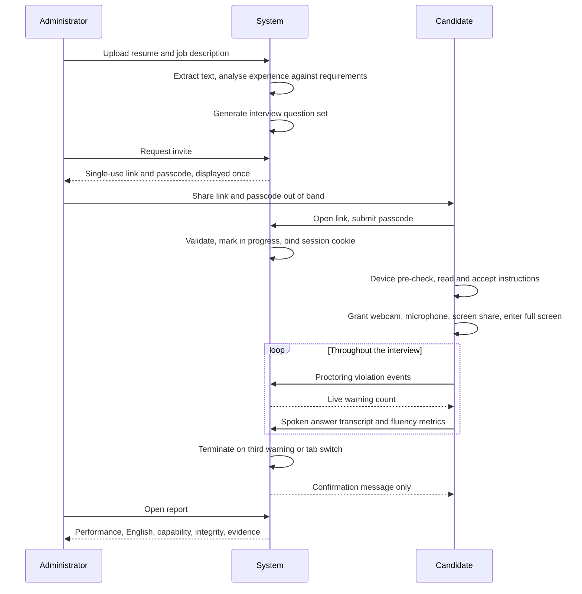
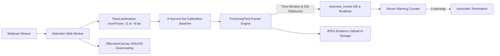

# AI Proctored Mock Interview Module

## Technical Design Document

**Project:** Creole Knowledge Portal
**Module:** AI Proctored Mock Interview
**Status:** Planning — pending approval
**Date:** 8 September 2026

---

## 1. Executive Summary

This module allows an administrator to upload a candidate's resume together with a job description. The system analyses the candidate's experience against the job requirements, generates a tailored set of interview questions, and issues a passcode-protected, single-use meeting link.

The candidate opens the link once, reads a mandatory instructions screen, grants webcam, microphone and full-screen access, and completes a spoken mock interview under continuous AI supervision. The session monitors eye movement, hand movement, facial expression, prohibited objects, multiple faces, background noise, tab switching, and English fluency in real time.

Rule violations produce live on-screen warnings. Three warnings terminate the session automatically. Switching browser tabs terminates the session immediately.

When the session ends the candidate sees only a confirmation message. The complete analysis report is delivered exclusively to the administrator.

**Scope note:** This document covers the **mock interview** session type only. Written quiz assessments are out of scope.

---

## 2. Objectives

1. Generate interview questions automatically from a resume and job description pair.
2. Distribute the interview through a secure, single-use, passcode-protected link.
3. Supervise the candidate continuously and in real time throughout the session.
4. Measure spoken English proficiency and fluency objectively.
5. Assess candidate performance and problem-solving capability.
6. Deter and detect malpractice, terminating the session when rules are breached.
7. Deliver a complete evaluation report to the administrator while withholding all results from the candidate.

---

## 3. Design Decisions

| Decision | Choice | Rationale |
|---|---|---|
| Session type | Automated, self-paced spoken interview | No human interviewer or peer-to-peer video required |
| Detection location | Entirely in the candidate's browser | Zero inference cost, preserves privacy, achieves real-time latency |
| Data sent to server | Small JSON events only, no video stream | Keeps bandwidth minimal and avoids storing continuous footage |
| Candidate identity | Anonymous, no account required | Access is controlled by the invite token and passcode |
| Report delivery | Administrator dashboard | No email provider is currently installed in the project |
| Warning threshold | Three warnings, then automatic termination | As specified in the requirements |
| Tab switching | Immediate termination | As specified in the requirements |

---

## 4. Technology Stack

### 4.1 Existing platform

| Layer | Technology |
|---|---|
| Framework | Next.js 15, App Router |
| Language | TypeScript, React 19 |
| Styling | Tailwind CSS 4 |
| Database and storage | Supabase, PostgreSQL with Row Level Security |
| Authentication (administrator) | Supabase Auth |
| Artificial intelligence | Google Gemini via `@google/genai` |

### 4.2 New libraries required

| Purpose | Library | Justification |
|---|---|---|
| PDF text extraction | `unpdf` | Serverless-compatible, requires no native binaries |
| DOCX text extraction | `mammoth` | Standard, reliable DOCX to text conversion |
| Computer vision suite | `@mediapipe/tasks-vision` | Provides face landmarks, hand landmarks and object detection from a single package |
| Voice activity detection | `@ricky0123/vad-web` | Silero VAD running in the browser, distinguishes speech from silence and noise |

Four new packages in total. All are free and open source. No paid third-party service is introduced.

### 4.3 Browser platform interfaces

| Purpose | Interface |
|---|---|
| Screen sharing | `navigator.mediaDevices.getDisplayMedia` |
| Webcam and microphone | `navigator.mediaDevices.getUserMedia` |
| Full-screen enforcement | Fullscreen API |
| Tab switch detection | `visibilitychange` and `blur` events |
| Speech to text | Web Speech API, `SpeechRecognition` |
| Audio level measurement | Web Audio API, `AnalyserNode` |
| Background inference | Web Worker with `OffscreenCanvas` |

---

## 5. End-to-End Process Flow



---

## 6. Stage 1 — Question Generation from Resume and Job Description

### 6.1 Process

1. The administrator uploads the resume in PDF or DOCX format and the job description as a file or pasted text.
2. Both files are stored in a private Supabase Storage bucket named `interview-docs`. They are never publicly accessible.
3. The server extracts plain text using `unpdf` for PDF files and `mammoth` for DOCX files.
4. The extracted text is sent to Gemini, which returns a structured JSON object containing the candidate profile, the job requirements, and the gap between them.
5. Gemini then generates the interview question set, weighted towards the requirements the candidate has not clearly demonstrated.

### 6.2 Structured analysis output

```json
{
  "candidate": {
    "headline": "",
    "years_experience": 0,
    "skills": [],
    "highlights": []
  },
  "job_description": {
    "title": "",
    "must_have": [],
    "nice_to_have": [],
    "seniority": ""
  },
  "skill_gap": {
    "strong": [],
    "partial": [],
    "missing": []
  }
}
```

### 6.3 Question composition

Questions are tagged by intent so the report can break performance down by category.

| Intent | Purpose |
|---|---|
| Technical | Verify depth in the must-have skills |
| System design | Assess architectural reasoning, for senior roles |
| Behavioural | Assess collaboration, ownership and communication |
| Role fit | Probe motivation and alignment with the position |

Difficulty is derived from the candidate's years of experience measured against the seniority stated in the job description. A junior candidate applying for a mid-level role receives questions calibrated to the role, not to the resume, so the gap is visible in the results.

Every question must reference a specific job requirement or a specific resume claim. Generic questions unrelated to the role are rejected and regenerated.

---

## 7. Stage 2 — Secure Single-Use Invite Link

### 7.1 Link generation

1. The administrator requests an invite for a prepared interview session.
2. The server generates a high-entropy random token and a separate numeric passcode.
3. Only the SHA-256 hash of the token and a salted scrypt hash of the passcode are stored. The plain values are returned to the administrator once and never stored or displayed again.
4. The administrator shares the link and passcode with the candidate through their own channel. The passcode is never embedded in the URL.

### 7.2 Single-use enforcement

1. The candidate opens the link and submits the passcode.
2. The server verifies the passcode using a constant-time comparison, sets the invite status to in progress, and issues an httpOnly session cookie bound to that invite.
3. Any subsequent visit without that cookie, whether from a different browser, a different device or a private window, is rejected with the message that the link is no longer valid.
4. A refresh or a brief network drop within the same browser is permitted, because the bound cookie identifies the same session. Answers are saved per question, so a disconnection loses at most the answer in progress.
5. Once the interview finishes or is terminated, the invite is marked completed and can never be opened again.

### 7.3 Additional controls

- Invites carry a time-to-live, defaulting to seventy-two hours.
- The administrator can revoke an unused invite at any time.

---

## 8. Stage 3 — Pre-Interview Screens

### 8.1 Device pre-check

Before instructions are shown, the application verifies that the browser is supported, that the webcam and microphone are available, that the microphone input level is adequate, and that the device can sustain the required inference frame rate. If the device is too slow the candidate is warned before committing to the session rather than failing midway through.

### 8.2 Mandatory instructions screen

The candidate must read and explicitly acknowledge the rules before any media permission is requested. The continue button remains disabled until the content has been scrolled and the acknowledgement checkbox is ticked. The screen states:

1. Your entire screen must remain shared for the whole interview.
2. Your webcam must remain on and your face must be clearly visible.
3. Only you may appear in the camera frame. No other person is permitted.
4. Look at the screen. Prolonged looking away is recorded.
5. Mobile phones, books, and additional laptops or monitors must not be visible.
6. Sit in a quiet room. Background noise is monitored.
7. Do not switch browser tabs or leave the interview window. Doing so ends the interview immediately.
8. Do not exit full-screen mode.
9. Warnings appear on screen in real time. After three warnings the interview ends automatically and is submitted as it stands.
10. Your microphone records your spoken answers. Your spoken English is assessed.
11. Results are not shown at the end. You will be contacted separately.

---

## 9. Stage 4 — Session Environment Controls

| Control | Mechanism | Behaviour on breach |
|---|---|---|
| Entire screen share | `getDisplayMedia`, monitor surface required | Fifteen second grace to restore, then termination |
| Webcam | `getUserMedia` video, picture-in-picture preview | Fifteen second grace to restore, then termination |
| Microphone | `getUserMedia` audio | Fifteen second grace to restore, then termination |
| Full screen | Fullscreen API with `fullscreenchange` listener | Immediate termination |
| Tab switching | `visibilitychange` and `blur` events | Immediate termination |

Window or single-tab screen shares are rejected. Only a full monitor share is accepted, verified through the `displaySurface` track setting where the browser reports it.

The existing helper module `lib/quizzes/proctor.ts` already implements entire-screen and webcam acquisition and will be generalised into a shared `lib/proctor/` package for reuse.

---

## 10. Stage 5 — Real-Time Visual Supervision

### 10.1 Architecture

Three vision models run off the main thread inside a Web Worker using `OffscreenCanvas` downscaling ($320\times 240$) to minimize candidate CPU and GPU load:



### 10.2 Detection rules

| Signal | Model and method | Trigger condition |
|---|---|---|
| Head turned away (`gaze_away`) | FaceLandmarker 4x4 matrix vs calibrated baseline | $|\Delta \text{yaw}| > 25^\circ$ OR $|\Delta \text{pitch}| > 20^\circ$ sustained for $> 2\text{s}$ |
| Fine iris gaze ratio | 478 landmarks (iris 468/473 vs eye corners 33/133 & 263/362) | Normalized iris center offset $> 0.35$ relative to calibrated baseline |
| Reading suspected (`reading_suspected`) | Frontal head pose + `eyeLookDown`/`eyeLookOut` blendshapes | Sustained downward/sideways eye glance $> 2\text{s}$ while head is straight |
| Facial expression | FaceLandmarker blendshapes (`mouthSmile`, `browDown`, `mouthPress`) | Rolling average for communication/stress confidence scoring |
| Multiple faces (`multi_face`) | FaceLandmarker configured for `numFaces: 2` | $\ge 2$ faces detected continuously for $> 2\text{s}$ |
| Absent candidate (`no_face`) | FaceLandmarker | No face detected continuously for $> 3\text{s}$ |

Every rule is debounced ($20\text{s}$ per category) and requires continuous time-window validation.

### 10.3 Evidence & Realtime Monitoring

Each violation generates a JPEG evidence frame uploaded to Supabase Storage (`interview-snapshots/`) and publishes a Realtime event to the HR live monitoring channel.

---

## 11. Stage 6 — English Fluency and Proficiency

Fluency and proficiency are separate measurements captured by separate mechanisms.

**Fluency** describes delivery mechanics: pace, smoothness, hesitation. It is pure arithmetic derived from timing and transcript data, requires no model, and is computed instantly in the browser.

**Proficiency** describes language quality: grammar, vocabulary, coherence. It requires a language model and is evaluated on the server after each answer.

Neither measurement can terminate the interview. Poor English is scored, never punished. The only speech-related warning is prolonged silence, which prevents a candidate from running down the clock.

### 11.1 Libraries and their contribution

| Sub-signal | Library or interface | Output |
|---|---|---|
| Speech and silence boundaries | `@ricky0123/vad-web`, Silero VAD in the browser | Speech start and end timestamps, giving true speaking duration |
| Words spoken | Web Speech API `SpeechRecognition` | Interim and final transcripts with per-result confidence |
| Audio level and noise floor | Web Audio `AnalyserNode` | Root-mean-square energy, used for noise events and audio quality flags |
| Fluency metrics | Project module `lib/interview/fluency.ts` | Words per minute, pause ratio, filler rate, repetition rate |
| Grammar, vocabulary, coherence, CEFR band | Gemini via `@google/genai` | Structured JSON language rubric |
| Fallback transcription | Gemini audio input | Used where `SpeechRecognition` is unavailable or confidence is low |

### 11.2 Detection sequence

1. The microphone stream is opened once during setup.
2. Silero VAD subscribes to that stream and emits speech-start and speech-end events, constructing a timeline of speech segments and silence gaps for the current answer.
3. In parallel, `SpeechRecognition` runs continuously with interim results, accumulating the transcript along with recognition confidence.
4. When the candidate completes an answer, the fluency module computes:

   - Total speech duration as the sum of voice-activity segments, and silence as the remainder of the answer duration.
   - Words per minute, calculated as word count divided by actual speaking time rather than elapsed time, so that pauses for thought do not depress the measured speaking rate.
   - Pause ratio, being silence within the answer divided by total answer duration.
   - Filler rate, matching a lexicon comprising um, uh, er, like, you know, actually, basically and I mean, expressed as a proportion of total words.
   - Repetition and self-correction rate, from repeated word pairs and restart markers.
   - Speech continuity, being the number of separate speech segments, where many short fragments indicate hesitancy.

5. These values are normalised into a fluency score between zero and one hundred using the following bands.

   | Metric | Strong | Acceptable | Weak |
   |---|---|---|---|
   | Words per minute | 110 to 160 | 90 to 110, or 160 to 190 | Below 90 or above 190 |
   | Pause ratio | Below 0.20 | 0.20 to 0.35 | Above 0.35 |
   | Filler rate | Below 2 percent | 2 to 5 percent | Above 5 percent |

6. The metrics and the transcript are transmitted with the answer and stored.
7. The server submits the transcript and its timing metadata to Gemini, which returns grammar accuracy, vocabulary range and appropriateness for the role seniority, sentence complexity, coherence, discourse structure, a CEFR-style band from A2 to C2, and brief qualitative feedback for the administrator.
8. The final English score combines the deterministic fluency score with the Gemini proficiency assessment.

Steps one through five execute entirely in the browser in real time. Step seven is the only component incurring an API call, and it occurs once per answer rather than continuously.

### 11.3 Pronunciation limitation

Genuine phoneme-level pronunciation assessment requires a commercial service such as Azure Speech pronunciation assessment. This design approximates intelligibility using speech-recognition confidence together with the language model's judgement, and the report labels the figure explicitly as an estimate rather than a measurement.

### 11.4 Candidate-facing display

The candidate sees only a microphone activity indicator and their live transcript. No score, band or metric is displayed at any point.

---

## 12. Stage 7 — Background Noise Detection

The same audio pipeline that supports fluency measurement also identifies environmental noise. Root-mean-square energy above the threshold while voice-activity detection reports an absence of speech, sustained for three seconds, raises a background noise warning and displays an on-screen indicator. Only speech segments are forwarded for transcription, so ambient sound is never mistaken for an answer.

---

## 13. Stage 8 — Candidate Capability Assessment

Capability is reported as a composite so that no single weak indicator dominates the outcome.

| Component | Source |
|---|---|
| Answer quality | Gemini assessment of correctness, depth, reasoning and use of concrete examples |
| Role relevance | Alignment of answers with the must-have requirements |
| Response latency | Time from question display to the start of speech, normalised by question difficulty |
| Confidence indicators | Filler rate, hesitation, self-correction, and the facial expression stream |

The result is presented as a score from zero to one hundred accompanied by its contributing sub-scores, never as a single unexplained figure.

---

## 14. Warning and Termination Policy

### 14.1 Warning-eligible violations

Looking away from the screen, suspicious hand movement, anomalous facial expression, a prohibited object in frame, multiple faces, sustained background noise, and repeated prolonged silence each increment the warning counter. A red banner appears immediately, for example "Warning 2 of 3: mobile phone detected".

### 14.2 Immediate termination

Switching tabs and exiting full screen terminate the interview without warning, recorded as a tab switch. A configuration flag permits this to be relaxed to a warning after an initial pilot, should accidental key presses prove disruptive.

### 14.3 Termination on threshold

Upon the third warning the server records automatic termination, refuses further answer submissions, stops all media streams, and presents the confirmation screen.

### 14.4 Media revocation

Loss of camera, microphone or screen share allows a fifteen second grace period for restoration, after which the session terminates and is recorded as media revoked.

---

## 15. Candidate Completion Screen

Regardless of whether the interview completes normally or terminates early, the candidate sees a single message and nothing else:

> **Your test is submitted. We will come back to you in sometime.**

No score, no band, no integrity figure, no correct answers, and no indication of why a session ended are ever displayed. Every candidate-facing API response is constructed to exclude assessment data entirely, and this is verified during code review.

---

## 16. Administrator Report

One page per interview session, containing:

- Candidate summary, role summary, and the skill gap that determined the questions.
- Overall performance score with a per-question breakdown and written feedback.
- English assessment: overall score, CEFR band, grammar, vocabulary and coherence sub-scores, together with fluency metrics comprising words per minute, pause ratio and filler rate.
- Capability composite with its constituent sub-scores.
- Integrity score, the reason the session ended, and a chronological timeline of every violation with counts and captured evidence frames.
- Full transcript of every answer.

Delivery is through the administrator dashboard. An email notification can be added subsequently; this requires introducing a mail provider, as none is presently installed.

---

## 17. Data Model

A single additive migration introduces the following tables. No existing table is altered.

| Table | Contents |
|---|---|
| `interview_sessions` | Document storage paths, parsed resume, parsed job description, skill gap, experience level, creating administrator, status |
| `interview_invites` | Token hash, passcode hash and salt, status, expiry, bound session identifier, maximum warnings |
| `interview_questions` | Generated question set with intent and difficulty |
| `interview_answers` | Transcript, time to first response, total time taken |
| `interview_speech_metrics` | Words per minute, pause ratio, filler rate, repetition rate, segment count, speech and silence durations |
| `interview_events` | Every proctoring signal with type, severity, metadata, evidence path and client timestamp |
| `interview_reports` | Performance, English, capability, integrity, termination reason, generated summary |

Administrators read all records through the existing `requireAdminUser()` helper. Because candidates are anonymous, their records are written exclusively by service-role routes after the invite token and session cookie have been validated. Row Level Security prevents any other access path.

---

## 18. Application Interface Map

### 18.1 Administrator endpoints

| Method | Route | Purpose |
|---|---|---|
| POST | `/api/interviews` | Upload resume and job description |
| POST | `/api/interviews/[id]/parse` | Extract text and produce structured analysis |
| POST | `/api/interviews/[id]/generate` | Generate the interview question set |
| POST | `/api/interviews/[id]/invite` | Issue the single-use link and passcode |
| POST | `/api/interviews/[id]/invite/revoke` | Revoke an unused invite |
| GET | `/api/admin/interviews/[id]/report` | Retrieve the full analysis |

### 18.2 Candidate endpoints

No response from any endpoint below contains assessment data.

| Method | Route | Purpose |
|---|---|---|
| GET | `/assess/[token]` | Passcode entry page |
| POST | `/api/assess/[token]/verify` | Validate passcode and establish the bound session |
| POST | `/api/assess/[token]/start` | Begin after instructions are accepted and media granted |
| POST | `/api/assess/[token]/answer` | Submit transcript and fluency metrics |
| POST | `/api/assess/[token]/events` | Report a violation, receive the authoritative warning count |
| POST | `/api/assess/[token]/finish` | Conclude and return the confirmation message only |

---

## 19. Implementation Sequence

| Stage | Deliverable |
|---|---|
| 1 | Database migration, private document bucket, type definitions, token and passcode cryptography with unit tests |
| 2 | Document upload, text extraction, structured analysis, question generation, administrator interface for creating a session and copying the invite |
| 3 | Passcode gateway, single-use enforcement with session binding, device pre-check, instructions screen |
| 4 | Shared proctoring package, microphone capture, full-screen lock, tab-switch termination, media revocation handling |
| 5 | Vision worker with three models, debounced rule engine, event ingestion with server-held counter, warning banner, automatic termination, evidence capture |
| 6 | Voice activity detection, transcription, real-time fluency metrics, prolonged silence handling, spoken answer flow |
| 7 | Gemini rubrics for performance and English proficiency, capability composite, integrity derivation |
| 8 | Administrator report interface, confirmation screen, retention job, complete test pass |

Each stage concludes with `npm run test` and `npm run lint`, together with a manual verification that no candidate-facing response body contains assessment data.

---

## 20. Security and Privacy

- Resume, job description and evidence frames reside in private buckets. No public URL is ever issued.
- The Gemini API key and the Supabase service role key remain strictly server-side.
- Invite tokens and passcodes are stored only as hashes.
- Consent for camera, microphone and screen capture is obtained explicitly on the instructions screen, including the retention period.
- No continuous video is recorded in this design. Only discrete evidence frames are stored, and these expire on a retention schedule.
- Candidate-facing responses are constructed to exclude assessment data by design, not by filtering.

---

## 21. Risks and Mitigations

| Risk | Mitigation |
|---|---|
| Three vision models degrade performance on low-specification hardware | GPU delegation, worker isolation with `OffscreenCanvas` (300x300 downsampling), `lite_mobilenet_v2` for sub-2s startup and low latency inference |
| Object detection false positives or latency | Tuned confidence floor (0.28) on tracked classes (`phone`, `earbuds`, `book`, `second_screen`, `remote`), real-time alert trigger (`thresholdMs: 0`), and a 5-second per-object debounce |
| The Web Speech API is available only in Chromium browsers | Browser support is verified before the session begins, with Gemini audio transcription as the fallback path |
| Poor microphone quality distorts fluency metrics | The pre-flight check measures input level, and the report flags low audio quality so that scores are interpreted in context |
| Immediate termination on tab switch penalises accidental key presses | A configuration flag allows this to be softened to a warning following a pilot |
| Pronunciation cannot be measured precisely without a paid service | The estimate is labelled clearly as such in the report |

---

## 22. Out of Scope

- Written quiz assessments.
- A live human interviewer or peer-to-peer video conferencing.
- Government identity verification.
- Continuous video recording of the session.
- Any results being disclosed to the candidate.
- Optical character recognition for scanned image-only resumes.

---

*End of document.*
